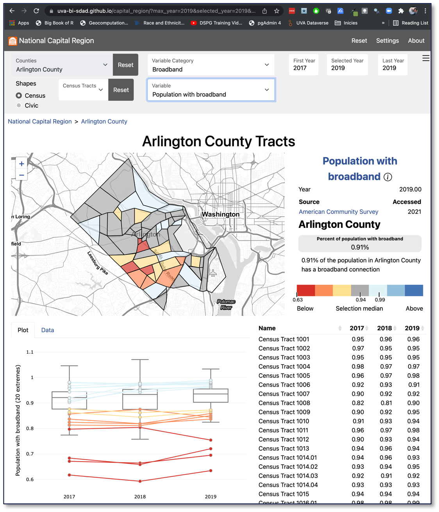

## Average download speeds in Arlington County

Average download speeds (from Ookla) are relatively high across Arlington with the slowest average still above 100Mb (the newer standard for “broadband”) \n 
Ookla data only recently made available in 600-meter squares that we translated to block groups \n
Broadband is available in Arlington County

### Population with broadband in Arlington County
However, specific areas can be identified that have a significantly lower level of broadband adoption the the rest of Arlington

## Cost of broadband as a percentage of average income in Arlington County
Calculated % or household income vs cost of 100Mb/s in every block group \n 
These areas of lowest broadband adoption appear to directly correlate with the areas having the highest ratio of household income to the cost of broadband, indicating an economic issue, as opposed to an issue of availability.

## Digital equity index

* Average download speeds (from Ookla) are relatively high across Arlington with the slowest average still above 100Mb (the newer standard for "broadband")
* Ookla data only recently made available in 600-meter square that we translated into block groups
* However, specific areas can be identified that have a significantly lower level of broadband adoption than the rest of Arlington
* Calculated & of household income vs cost of 100Mb/s in every block group
* These areas of lowest broadband adoption appear to correlate with the areas having the highest ratio of household income to the cost of broadband, indicating an economic issue, as opposite to an issue of availability
* Digital equity index
