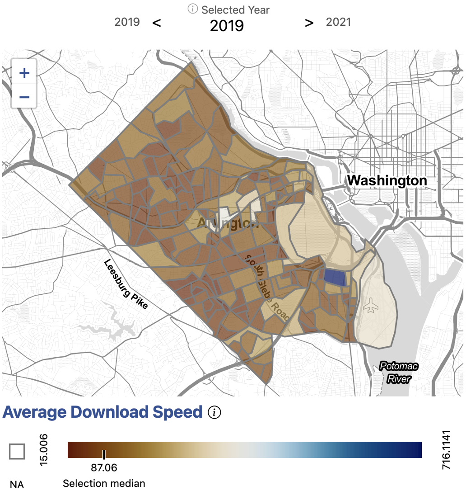
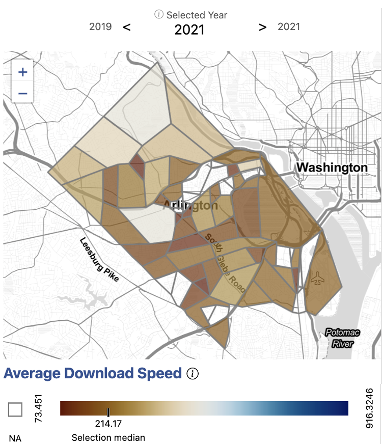
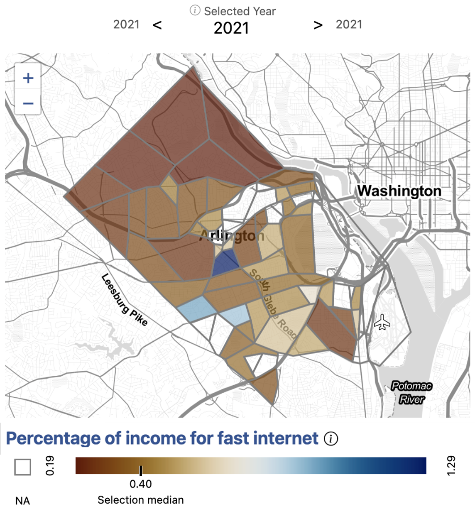

### Issue overview

Our stakeholders in Arlington County were interested in understanding the nuances of access to broadband in their community. While anecdotal evidence and existing data sources can tell us that high-speed Internet is not accessible to everyone, there is not enough information at the sub-county level to tell us where exactly the households in need are. Also, the contributing factors for inaccessibility are not always obvious. Both of these pieces of information are critical for local governments, such as Arlington County, to develop effective policy to bridge the digital divide.

### What broadband infrastructure exists in Arlington?

{width="600px" style="float: right;"}

We began by examining Internet speeds in Arlington. We used information provided by [Ookla](https://www.ookla.com/ookla-for-good/open-data), an Internet speed test service. Ookla provides Internet speeds in 600 meter squares squares, which we translated into Census tracts. \n

We saw that Internet speeds are relatively high across Arlington. Even the slowest average download speeds were still above 100Mb, which is the standard for high-speed Internet or broadband. \n 

From this, we understood that the infrastructure for broadband is highly available in Arlington County.

### Who has adopted broadband?

{width="600px" style="float: left;"}

Next, we wanted to understand the rates of broadband adoption across different parts of Arlington County. \n

We used information from the [American Community Survey](https://www.census.gov/programs-surveys/acs) to analyze the percentage of households with broadband by Census tracts. \n

From this, we saw that while broadband adoption was high overall throughout the county, there remained some pockets of the County with noticably lower rates. Given the availability of broadband infrastructure in these areas, we sought to better understand the contributing factors to their lower rates of adoption.

### Why isn't broadband accessibile to everyone?

{width="600px" style="float: right;"}

We scraped [BroadbandNow](https://broadbandnow.com/), an aggregator of Internet price packages, for information on the average cost of broadband in a given area. We combined this Internet cost information with data from the American Community Survey on average income. Given this, we were able to calculate the cost of broadband as a percent of income in the County. \n

We saw that the areas of lowest broadband adoption appear to directly correlate with the areas having the highest ratio of household income to the cost of broadband. This indicated that broadband accessibility is likely related to economic affordability, rather than infrastructure, in Arlington County. \n

Knowing at a granular geographic level where households face difficulty accessing high speed Internet enables Arlington County stakeholders to make better informed policy decisions regarding allocation of broadband resources, as well as the types of resources offered.

<!--
## Digital equity index

* Average download speeds (from Ookla) are relatively high across Arlington with the slowest average still above 100Mb (the newer standard for "broadband")
* Ookla data only recently made available in 600-meter square that we translated into block groups
* However, specific areas can be identified that have a significantly lower level of broadband adoption than the rest of Arlington
* Calculated & of household income vs cost of 100Mb/s in every block group
* These areas of lowest broadband adoption appear to correlate with the areas having the highest ratio of household income to the cost of broadband, indicating an economic issue, as opposite to an issue of availability
* Digital equity index -->

