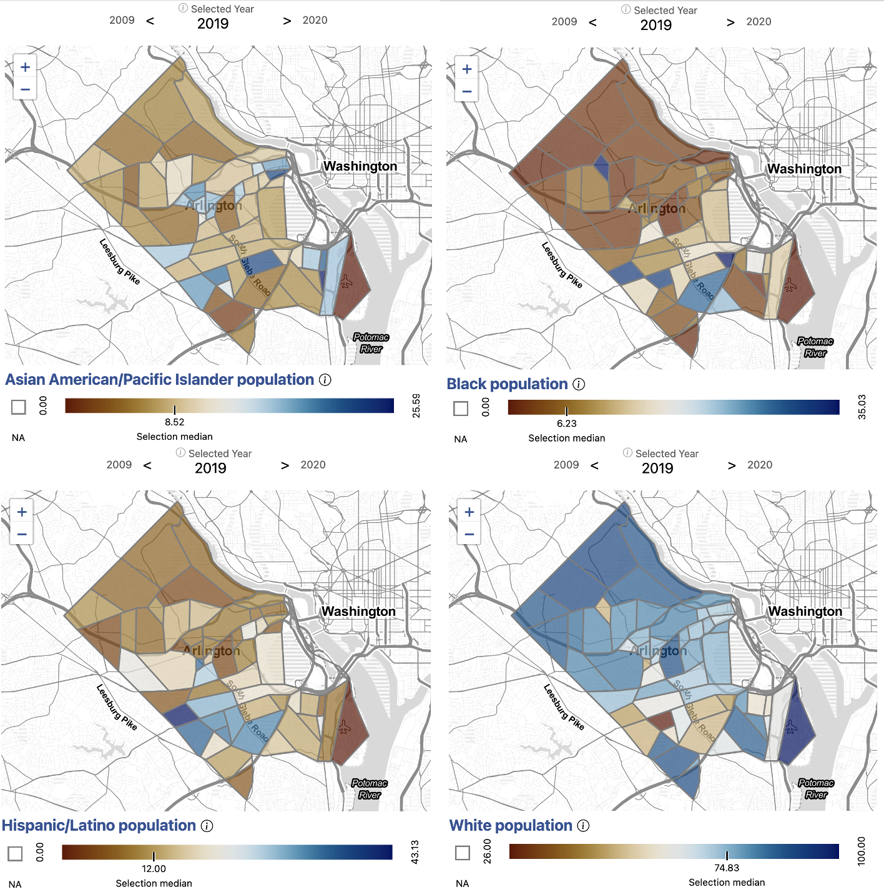
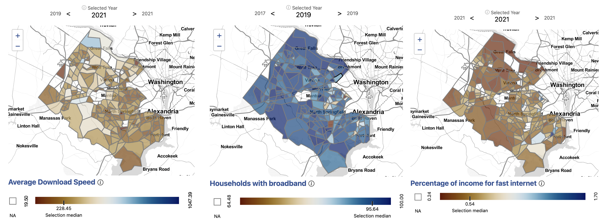

Issue overview

Our stakeholders in Arlington County were interested in understanding the nuances of access to broadband in their community. While anecdotal evidence and existing data sources can tell us that high-speed Internet is not accessible to everyone, there is not enough information at the sub-county level to tell us where exactly the households in need are. Also, the contributing factors for inaccessibility are not always obvious. Both of these pieces of information are critical for local governments, such as Arlington County, to develop effective policy to bridge the digital divide.

 What broadband infrastructure exists in Arlington? 

<figcaption> Exhibit 1. Average Internet Download Speeds in Arlington County by Census Block Group, 2019. </figcaption>
{width="400px" class="story_image"}
<figcaption> Data source: Ookla, accessed 2022 <a href = "https://uva-bi-sdad.github.io/capital_region/?shape_type=county&selected_county=51013&selected_variable=avg_down_using_devices&selected_year=2019&filter.time_min=2019&filter.time_max=2021">   Explore this measure on our dashboard </a> </figcaption>

We began by examining Internet speeds in Arlington. We used information provided by [Ookla](https://www.ookla.com/ookla-for-good/open-data), an Internet speed test service. Ookla provides Internet speeds in 600 meter squares squares, which we translated into Census tracts and block groups. Exhibit 1 shows internet speeds in Arlington by block group. \n

We saw that Internet speeds are relatively high across Arlington. Even the slowest average download speeds were still above 100Mb, which is the standard for high-speed Internet or broadband. \n 

From this, we understood that the infrastructure for broadband is highly available in Arlington County.

 Who has adopted broadband? 

<figcaption> Exhibit 2. Households With a Broadband Internet Connection in Arlington County by Census Block Group, 2019. </figcaption>
{width="400px" class="story_image"}
<figcaption> Data source: American Community Survey, Table B28002, accessed 2021 <a href = "https://uva-bi-sdad.github.io/capital_region/?shape_type=county&selected_county=51013&selected_variable=perc_hh_with_broadband&selected_year=2019&filter.time_min=2017&filter.time_max=2019">   Explore this measure on our dashboard </a> </figcaption>

Next, we wanted to understand the rates of broadband adoption across different parts of Arlington County. \n

We used information from the [American Community Survey](https://www.census.gov/programs-surveys/acs) to analyze the percentage of households with broadband by Census tracts. Exhibit 2 shows the percentage of households in the County with a broadband internet connection. \n

From this, we saw that while broadband adoption was high overall throughout the county, there remained some pockets of the County with noticeably lower rates. Given the availability of broadband infrastructure in these areas, we sought to better understand the contributing factors to their lower rates of adoption.

 Why isn't broadband accessible to everyone? 

<figcaption> Exhibit 3. Average Price of Fast Internet as a Percentage of Income in Arlington County by Census Tract, 2021. </figcaption>
{width="400px" class="story_image"}
<figcaption> Data sources: American Community Survey (ACS),   Table B19013, accessed 2022   Broadband Now, accessed 2021 <a href = "https://uva-bi-sdad.github.io/capital_region/?shape_type=county&selected_county=51013&selected_variable=perc_income_min_price_100&selected_year=2021&filter.time_min=2021&filter.time_max=2021">   Explore this measure on our dashboard </a> </figcaption>

We scraped [BroadbandNow](https://broadbandnow.com/), an aggregator of Internet price packages, for information on the average cost of broadband in a given area. We combined this Internet cost information with data from the American Community Survey on average income. Given this, we were able to calculate the cost of broadband as a percent of income in the County, shown in Exhibit 3. \n

We saw that the areas of lowest broadband adoption appear to directly correlate with the areas having the highest ratio of household income to the cost of broadband. This indicated that broadband accessibility is likely related to economic affordability, rather than infrastructure, in Arlington County. \n

Knowing at a granular geographic level where households face difficulty accessing high speed Internet enables Arlington County stakeholders to make better informed policy decisions regarding allocation of broadband resources, as well as the types of resources offered.

 How does broadband access correlate with neighborhood demographics? 

<figcaption> Exhibit 4. Asian American/Pacific Islander Population in Arlington County by Census Tract, 2019 (Top Left), Black Population in Arlington County by Census Tract, 2019 (Top Right), Hispanic/Latino Population in Arlington County by Census Tract, 2019 (Bottom Left), White Population in Arlington County by Census Tract, 2019 (Bottom Right) </figcaption>
{width="700px" class="story_image"}
<figcaption>Data source: American Community Survey (ACS) Table B01001, accessed 2021.
    <a href = "https://uva-bi-sdad.github.io/capital_region/?plot_type=scatter&shape_type=county&selected_variable=demographics:perc_hispanic_or_latino&selected_year=2019&filter.time_min=2009&filter.time_max=2019&filter.county=51013">   Explore these measures on our dashboard </a> </figcaption>

When analyzing the relationship between demographics and access to broadband, we see that neighborhoods with higher White populations tend to have greater access to broadband. Exhibit 4 shows the percentage of selected racial and ethinic demographic groups living in Arlington census tracts.    
A higher than average population of Black, Hispanic/Latino, and Asian American/Pacific Islander Arlingtonians live along Colombia Pike, where the economic burden of broadband is generally highest in the county. Some of these areas are historically Black neighborhoods, such as Green Valley and Johnson's Hill.    
For example, the census tract with the highest economic burden of broadband has a White population of 59 percent (compared to the county average of 79), a Black population of 16 percent (compared to the county average of 6), and a Hispanic/Latino population of 23 percent (compared to the county average of 11).    
Our analysis indicates that the economic burden of broadband is higher on communities of color in Arlington.

 What does the story look like in Fairfax County? 

Exhibit 5 shows the infrastructure, adoption, and cost measures for broadband in Fairfax County. In Fairfax County, nearly all census tracts have an average download speed above 100 MB/s, indicating available and robust broadband infrastructure. Yet, there are pockets of low broadband adoption in the county even in areas where high-speed internet is available. We find that neighborhoods with low broadband adoption correlate with high ratios of the cost of broadband to income. This indicates that economic factors, as opposed to available infrastructure, are likely drivers of low broadband adoption.

<figcaption> Exhibit 5. Average Internet Download Speeds in Fairfax County by Census Tract, 2021 (Left), Percentage of Households With a Broadband Internet Connection in Fairfax County by Census Tract, 2019 (Middle), Average Price of Fast Internet as a Percentage of Income in Fairfax County by Census Tract, 2021 (Right) </figcaption>
{width="900px" class="story_image"}
<figcaption>Data Sources: Ookla, American Community Survey 2015/2019 Tables B28002 and B19013, and Broadband Now, accessed 2023.
    <a href = "https://uva-bi-sdad.github.io/capital_region/?plot_type=scatter&shape_type=county&selected_variable=perc_hh_with_broadband&selected_year=2019&filter.time_min=2009&filter.time_max=2019&filter.county=51019">   Explore these measures on our dashboard </a> </figcaption>

In both Arlington and Fairfax Counties where we were looking at broadband equity, the data show that the areas with the lowest broadband adoption appear to demonstrate a higher proportion of income being allocated toward broadband costs, indicating that broadband use is an economic issue as opposed to one of availability. 

 Impact 

These analyses were presented to the Arlington County Council and Fairfax County Board of Supervisors and are directly informing the region’s resource planning.

`r htmltools::includeHTML("./footer.html")`

