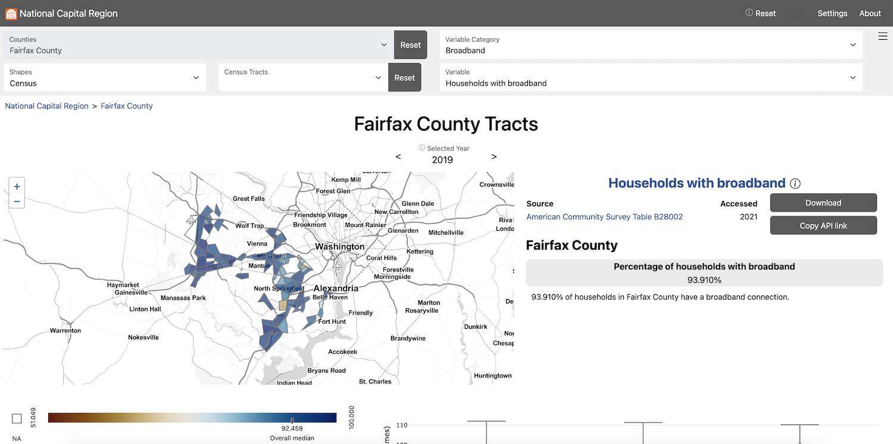

[{width=400px}](https://uva-bi-sdad.github.io/capital_region/?plot_type=scatter&shape_type=tract&variable_type=Broadband&selected_variable=speed_measurements:avg_down_using_devices&selected_year=2021&filter.time_min=2019&filter.time_max=2021)

Explore the Social Impact Data Commons for the National Capital Region

### Dashboard features
#### Explore measures by drilling down to geographies of interest

#### View measures over time using plots

#### Analyze relationships between measures using filters

#### Display measures by rank to compare regions

#### Access metadata for each measure

