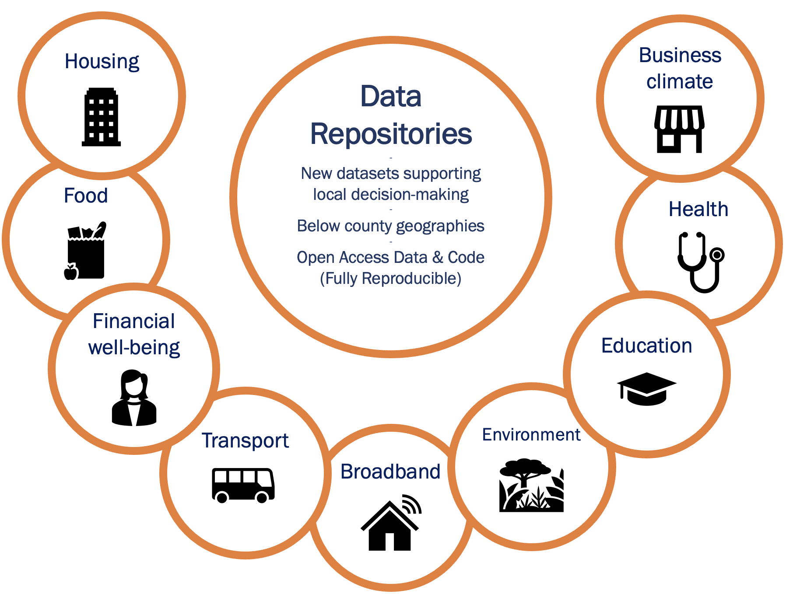

<style type="text/css">
  h1.title {
    text-align: center;
    margin-bottom: -3px;
  }
  h3.subtitle {
    text-align: center;
  }
</style>


<!-- Visit our [public data repositories](https://github.com/uva-bi-sdad). 
-->

<center>{width="600px" usemap="#repomap"}</center>

<map name="repomap">
  <area shape="circle" coords="76,72,40" href="https://github.com/uva-bi-sdad/sdc.housing">
  <area shape="circle" coords="63,182,40" href="https://github.com/uva-bi-sdad/sdc.food">
  <area shape="circle" coords="100,285,40" href="https://github.com/uva-bi-sdad/sdc.financial_well_being">
<!--  <area shape="circle" coords="186,364,40" href="https://github.com/uva-bi-sdad/sdc.transportation"> -->
  <area shape="circle" coords="298,390,40" href="https://github.com/uva-bi-sdad/sdc.broadband">
<!--  <area shape="circle" coords="405,360,40" href="https://github.com/uva-bi-sdad/sdc.environment"> -->
  <area shape="circle" coords="494,287,40" href="https://github.com/uva-bi-sdad/sdc.education">
  <area shape="circle" coords="533,186,40" href="https://github.com/uva-bi-sdad/sdc.health">
<!--   <area shape="circle" coords="519,74,40" href="https://github.com/uva-bi-sdad/sdc.business_climate"> -->
</map>

### Open Source

Our data repositories are **open and publicly accessible**. We also provide our code for ingesting raw data and preparing measures, as well as process and statistical documentation and metadata.

### Widely Available 

Our data repositories are replicated to the leading open data archives, including the University of Virginia Dataverse (LibraData) and the Inter-University Consortium of Political and Social Research (ICPSR) database.

<!-- ### Data library -->

```{r, echo = FALSE}
# library(reactable)
# library(data.table)
# 
# data_cats_tops <- fread("https://raw.githubusercontent.com/uva-bi-sdad/sdc.standards/main/src/data_categories_topics.csv")
# reactable(data_cats_tops,
#           groupBy = c("RepoName", "DataType", "DataCategory"))
```
