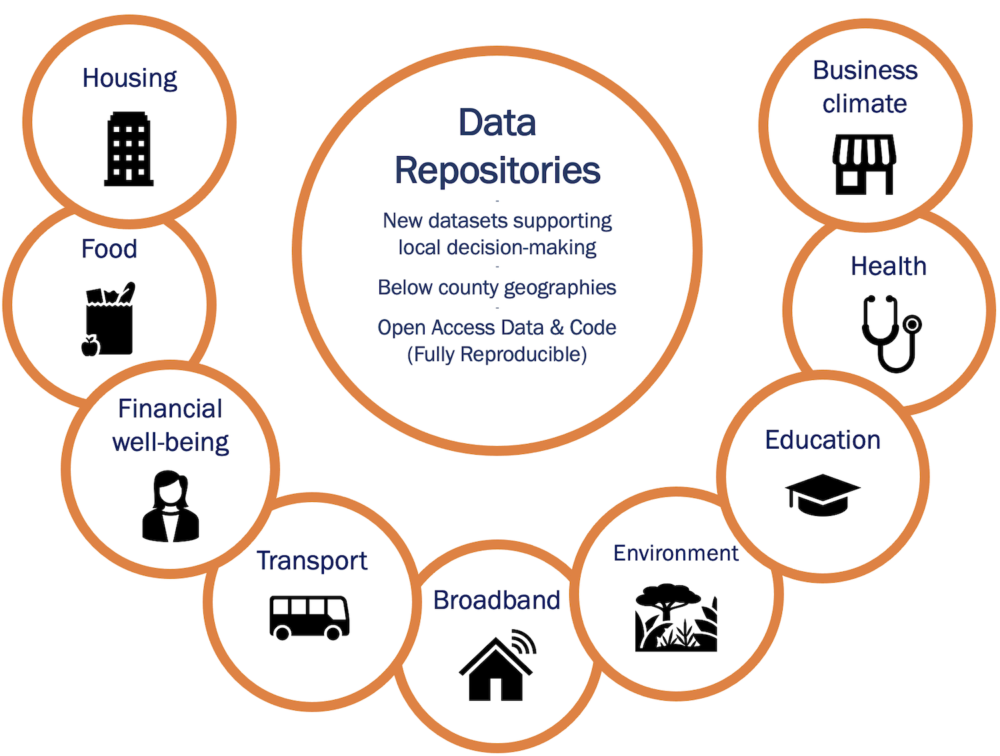

### Data library

Visit our [public data repositories](https://github.com/uva-bi-sdad]).

```{r, echo = FALSE}
library(reactable)
library(data.table)

data_cats_tops <- fread("https://raw.githubusercontent.com/uva-bi-sdad/sdc.standards/main/src/data_categories_topics.csv")
reactable(data_cats_tops,
          groupBy = c("REPO", "DATATYPE", "DATACATEGORY"))
```

### Data collection

We have collected data from a variety of sources


