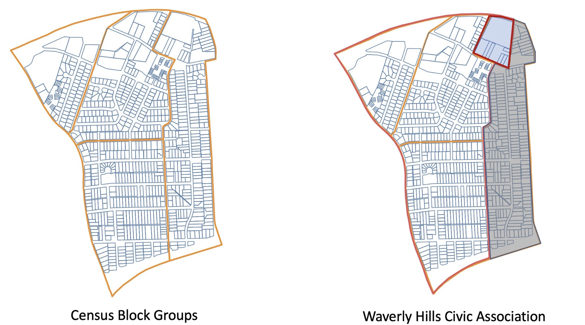
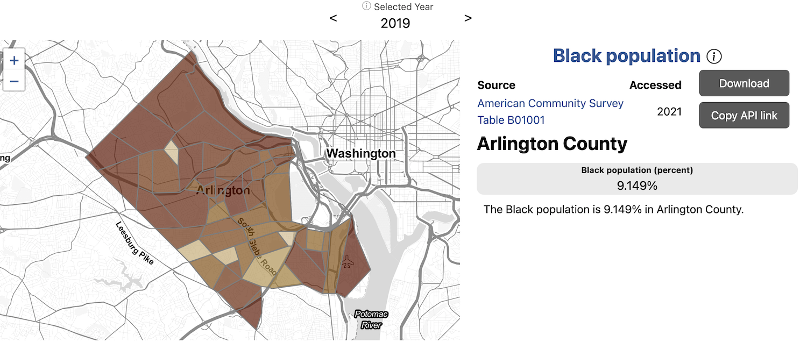
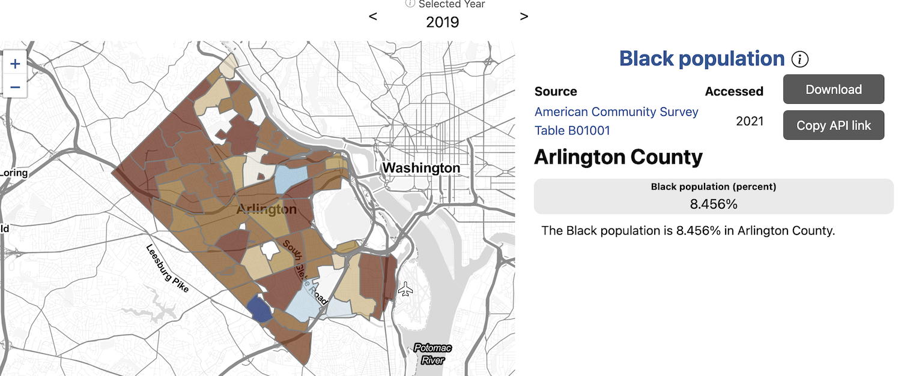
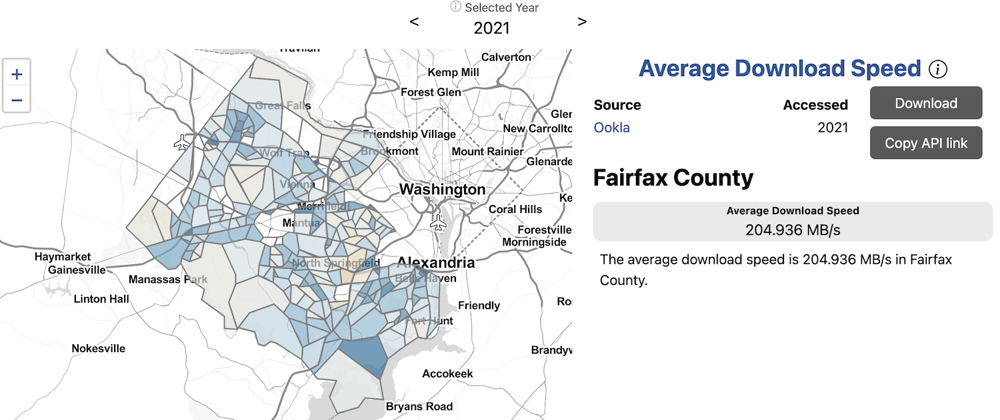
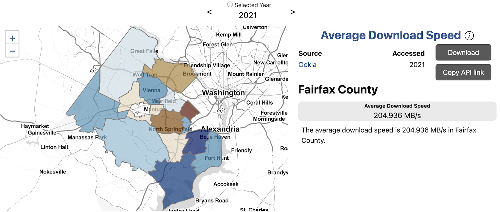

Often, data are not available in geographies relevant to local decisionmakers. For example, census geographies do not perfectly align with Arlington Civic Associations.

### Current approaches

We review the current approaches to deal with a partial overlap

* Policy Map - Must be overlapping 50% or more or leave it off
* City-Data, Esri, others - Use percentage overlap
* Our approach 1 - Allocate demographics to parcels according to number of housing units

### Creation of indicators at locally relevant geographies

#### Arlington County Black population example

#### Fairfax County average download speed example

Incorporating data from multiple sources: IPUMS, using IPF
