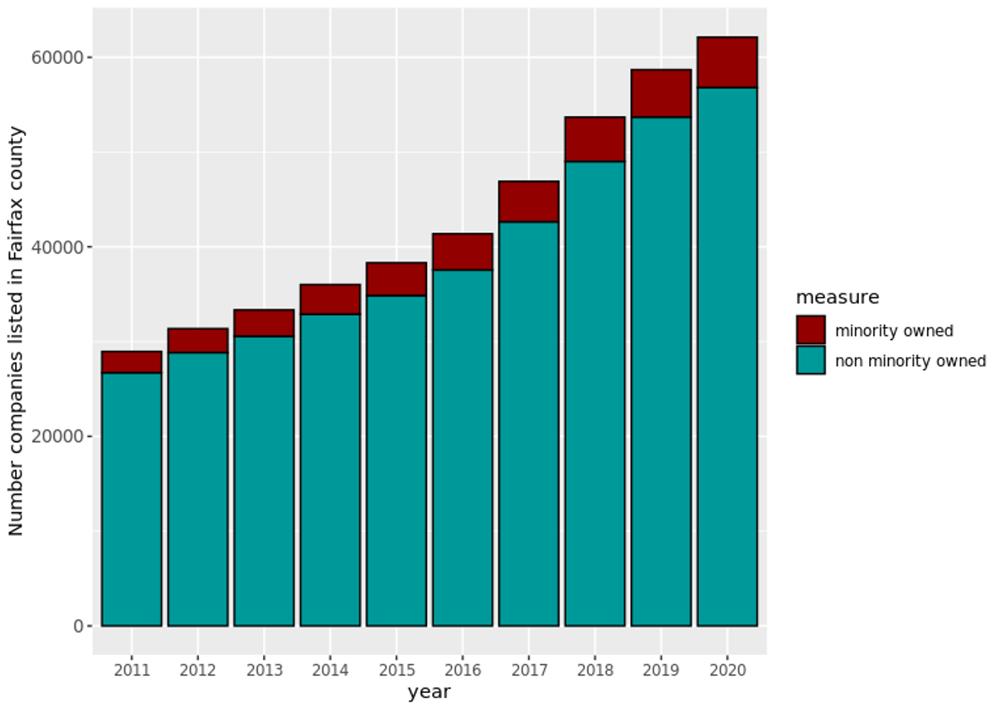
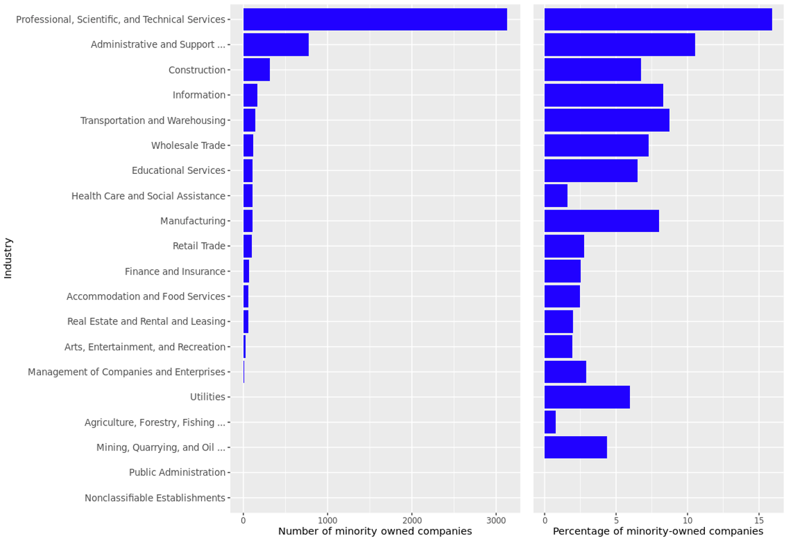
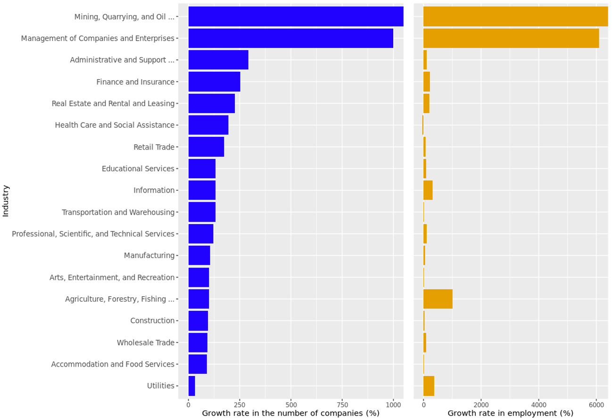
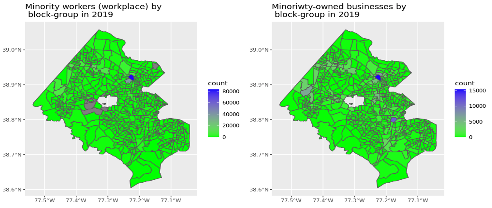
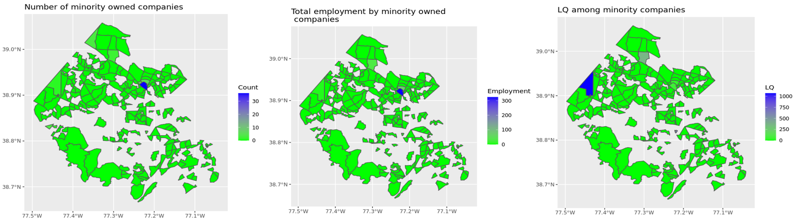

Issue overview

Our Arlington and Fairfax County stakeholders were interested in diving deeply into measures of economic health, specifically economic diversity in their counties. We began by analyzing the diversity of business ownership in the counties, collecting data from [Mergent Intellect](https://www.mergentintellect.com). To create policy-actionable metrics, we transformed data into relevant local geographies for decisionmaking, including business corridors. 

Defining economic diversity

**Company ownership diversity** refers to the diversity of company activities where owners belong to a minority group (in this case, women and minority ethic groups)
**Company economic diversity** refers to diversity of companies in terms of industry activities

We propose metrics to describe industry activities that are *cross-sectional* and *dynamic*. We also focus a subset of companies where owners belong to a minority group.

Overall trends

{width="400px" class="story_image"}
<figcaption> Data source: Mergent Intellect, accessed 2022  </figcaption>

Overall, there is an increasing number of companies in Fairfax County between 2011 and 2020. There is also a righting number of minority owned companies. This increase could be the result of improved data collection or a real increase. It is important to note that minority-owned companies still represent a small share of companies in Fairfax County. 

Measures of business ownership diversity

{width="400px" class="story_image"}
<figcaption> Data source: Mergent Intellect, accessed 2022  </figcaption>

In Fairfax, the top five industries where minority-owned companies operate are:

- Professional, scientific
- Administrative and support
- Construction
- Information 
- Transportation and warehousing

Employment

{width="400px" class="story_image"}
<figcaption> Data source: Mergent Intellect, accessed 2022  </figcaption>

However, those minority-owned companies represent less than 20% of all companies within the industry. Employment among minority-owned companies is concentrated in the top five industries where many minority-owned companies operate.
However, the share of employment by minority-owned companies in each industry remains below 23%. In most of those top five industries with many minority-owned companies, the share of employment is above 10%.

Changes from 2011 - 2020

{width="400px" class="story_image"}
<figcaption> Data source: Mergent Intellect, accessed 2022  </figcaption>

Employment by minority-owned companies in the Mining, Agriculture, and Arts industries is concentrated by a few companies owned by minorities. Between 2011 and 2020, employment by minority-owned companies has been more concentrated by a few companies in the mining, information, and wholesale trade industry. Less employment concentration by minority-owned companies has been observed in the Management of companies, administrative support, and public administration industry.

Business ownership diversity by location and employment

{width="800px" class="story_image"}
<figcaption> Data source: Mergent Intellect, accessed 2022  </figcaption>

A similar distribution of minority workers (workplace) and minority-owned businesses across census block groups [need to work on color to highlight the similarity]

Positive correlation between the number of minority-owned companies and minority workers across census block groups. 
Locations with many companies also have many minority-owned companies located in the area.

Therefore, the high number of minority employees working in an area with more minority-owned companies can be driven by the fact that the area also has more companies (which employ those minority workers).

Business ownership diversity by location and employment

{width="800px" class="story_image"}
<figcaption> Data source: Mergent Intellect, accessed 2022  </figcaption>

There is a specific block group where many minority-owned companies in the management of companies industry operate. A high share of employment by minority-owned companies in the management of companies industry is concentrated in the same block group where those minority-owned companies operate. However, it is not that block group that contributes to the management of companies industry activities.

The region with the highest number of minority-owned companies in the management of companies industry is driven by the fact the most significant growth in the number of minority-owned companies from that industry between 2011-2019 occurred in that region.
That same region has the highest growth in employment from minority-owned companies.
However, the contribution from that region to the management of the companies industry declined between 2011 to 2019.

`r htmltools::includeHTML("./footer.html")`
