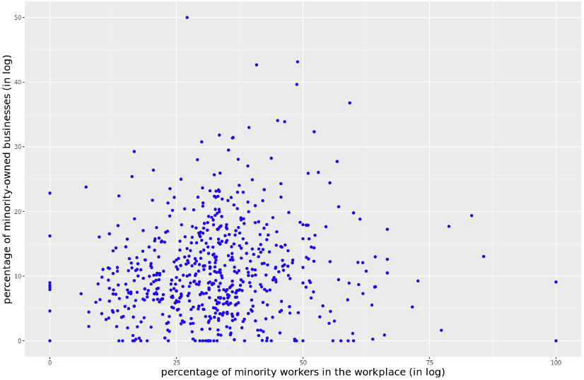

Overview

Fairfax County stakeholders are interested in understanding economic health, in particular economic diversity and minority business ownership. Specifically, our stakeholders are interested in gaining an overview of minority owned business activity in the County. We also wanted to study the relationship between minority businesses ownership and employment of minorities. To investigate this topic, we began by discovering existing data sources related to businesses. 

Data discovery

We found that [Mergent Intellect](https://www.mergentintellect.com), a data source licensed by the University of Virginia Library, contained information on business locations and minority ownership. To use this data to align with our stakeholder’s questions, we carefully examined available metadata and data dictionaries. A **minority owned business**, as defined by the [U.S. Small Business Administration (SBA)](https://in.nau.edu/contracting-purchasing-services/small-and-diverse-business-program-definitions/), must be majority (51%) owned by an individual or individuals belonging to minority racial or ethnic (Hispanic) groups. Other designations by SBA, such as Women and Veteran-owned businesses, were not within the scope of this investigation. 

In our process of data discovery, we found a large discrepancy between the composition of business ownership reported in Fairfax by the [U.S. Census Bureau Survey of Business Owners](https://experience.arcgis.com/experience/7a670bacb15b4e67b80982e6fd6a9fba/page/Demog-Composition/) and the composition reported by Mergent Intellect. As we will discuss in next steps, we are currently investigating methods to bridge this gap and efficiently use real-time opportunity data to investigate minority business ownership. 

For our investigation, we aimed to provide Fairfax County with a descriptive overview of business activity by minority owned businesses. To describe business activity, we collected information related to industry and time. To understand industry activity, we extracted industry classification data from Mergent Intellect. Mergent Intellect provides the North American Industry Classification System (NAICS) Code for businesses, which is a standard for collecting and publishing data related to the business economy. Mergent Intellect also reports the founding year of a business, so we inferred its years of operation between 2011-2020. Given these data, we proposed metrics to describe industry activities that are *cross-sectional* and *over time*. 

Overview of minority owned businesses

Exhibit 1 below presents data from Mergent Intellect to show the number of businesses in Fairfax County between 2011 and 2020 by minority and non-minority ownership. 

Mergent Intellect data show that the number of companies in Fairfax County has grown 112% between 2011 and 2020. The number of minority owned companies has grown 138%. Minority owned companies represent a small share of companies in Fairfax County. In 2011, the share of minority owned companies represented 7% of total companies which grew to 8% in 2020 (see Exhibit 1).

<figcaption>Exhibit 1: Number of Companies in Fairfax County, by Minority/Non-Minority Ownership, 2011-2020.</figcaption>
{width="600px" class="story_image"}
<figcaption> Data source: Mergent Intellect, accessed 2022  </figcaption>

In Fairfax County, the top five industries by minority owned business activity in 2020 are listed below (see Exhibit 2). The number in parentheses represents the share of minority owned companies in that industry (see Exhibit 2). 

- Professional, scientific (16%)
- Administrative and support (11%)
- Construction (7%)
- Information (8%)
- Transportation and warehousing (9%)

In 2020, minority owned companies represented less than 20% of all companies across all industries.

<figcaption>Exhibit 2: Number and Percentage of Minority-Owned Businesses by Industry in Fairfax County, 2020.</figcaption>
{width="600px" class="story_image"}
<figcaption> Data source: Mergent Intellect, accessed 2022  </figcaption>

The data from Mergent Intellect provide a general overview of minority owned business activity in Fairfax. The number of minority owned businesses in the county has grown relatively proportionally to business growth overall. We also see that minority owned businesses do not exceed more than 20% of total ownership in any industry.

The relationship between minority business ownership and minority employment

Exhibit 3 shows overall trends for employment by minority owned businesses across all industries. We see that employment is concentrated in industries characterized by high minority owned business activity: 

- Professional, scientific (21%)
- Administrative and support (17%)
- Construction (6%)
- Information (12%)
- Transportation and warehousing (19%)

The share of employment by minority owned companies in each industry remains below 23%. For all industries with high minority owned business activity except construction, the share of employment is above 10%.

<figcaption>Exhibit 3: Number and Percentage of Employment by Minority Owned Businesses in Fairfax County, 2020.</figcaption>
{width="600px" class="story_image"}
<figcaption> Data source: Mergent Intellect, accessed 2022  </figcaption>

Our stakeholders were interested in understanding the relationship between minority owned businesses and employment of minorities. The Longitudinal Employer-Household Dynamic Survey (LEHD) Origin-Destination Employment Statistics (LODES) provides data on jobs by Census block group broken down into racial and ethnic classifications. We were able to combine this data with information from Mergent Intellect to investigate the spatial relationship between minority owned businesses and minority employment. 

Exhibit 4 (Left) shows the percentage of minority employees by Census block group in Fairfax County in 2019. We observe that minority employment accounts for below 25% of total employment in most Census block groups in Fairfax. We also see pockets with higher concentrations of minority employment in the County. Exhibit 4 (Right) shows the percentage of minority businesses by Census block group in Fairfax County in 2019. We observe that minority ownership, as well, accounts for less than 20% of total ownership in most Census block groups in Fairfax. Again, we also see areas with higher concentrations of minority business ownership in the County.

<figcaption>Exhibit 4: Percentage of Minority Employees by Census Block Group in Fairfax County, 2019 (Left), Percentage of Minority Owned Businesses by Census Block Group in Fairfax County, 2019 (Right). </figcaption>
{width="700px" class="story_image"}
<figcaption> Data Source: Data sources: Longitudinal Employer-Household Dynamic Survey (LEHD) Origin-Destination Employment Statistics (LODES) (Left), Mergent Intellect, accessed 2022 (Right) </figcaption>

Exhibit 5 shows the relationship between between the percentage of minority owned businesses and the percentage of minority workers in Census block groups in Fairfax County in 2019. We see no correlation in the presence of minority owned businesses and the presence of minority employees. We were surprised by this finding, as we were expecting to find a positive relationship between these variables. A spatial correlation between minority business ownership and minority employment can be mostly explained by a higher concentration of businesses overall. In other words, more minority businesses operate in Census block groups with high business activity in general, and therefore higher employment overall, including minority employment. 

<figcaption>Exhibit 5. The Relationship Between the Percentage of Minority Owned Businesses and the Percentage of Minority workers in Census Block Groups in Fairfax County, 2019. </figcaption>
{width="600px" class="story_image"}
<figcaption> Data Source: Data sources: Longitudinal Employer-Household Dynamic Survey (LEHD) Origin-Destination Employment Statistics (LODES), Mergent Intellect, accessed 2022 </figcaption>

Next Steps

This analysis provides an early view of minority business ownership. We are continuing to collaborate with our stakeholders in Fairfax County to investigate the topic of minority business ownership. The next steps in our analysis include:

- Continuing to validate our results using U.S. Census Bureau Survey of Business Owners.
- Leveraging real-time opportunity data and modeling techniques to measure minority business ownership more accurately.
- Completing case studies to understand the business ownership and employment dynamics of specific industries or business corridor.
- Creating more metrics for studying this topic, including the exit and entry rate of businesses, as well as the creation and destruction of jobs.

`r htmltools::includeHTML("./footer.html")`
