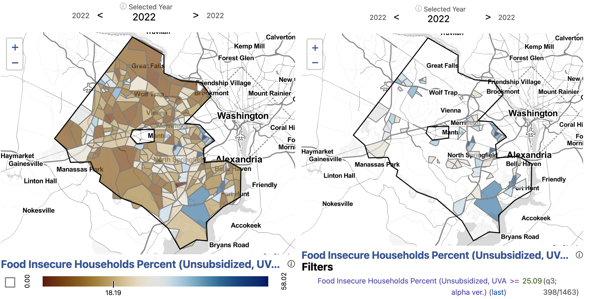
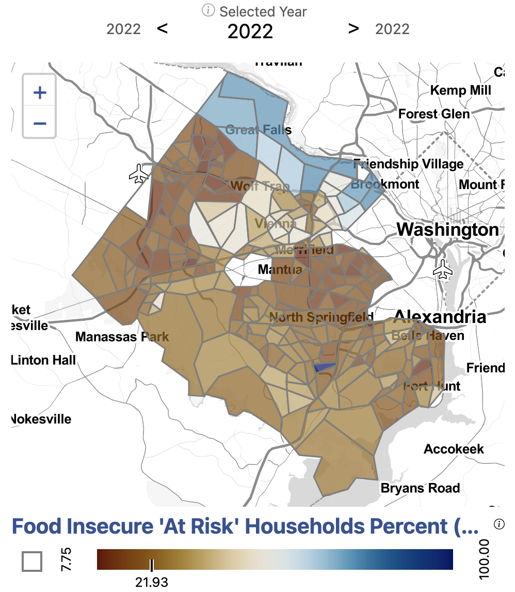
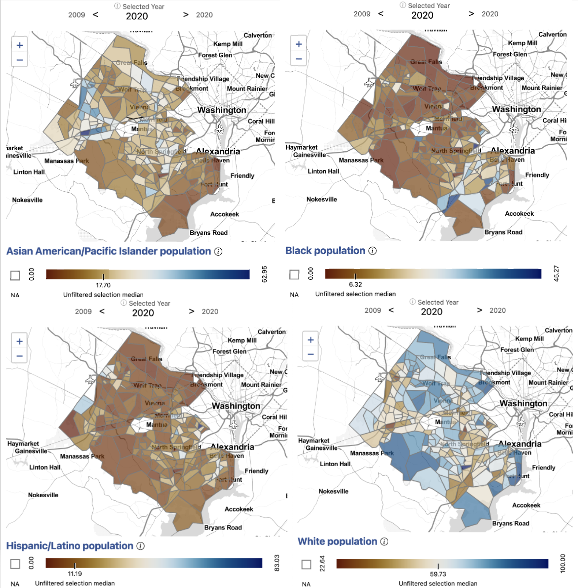
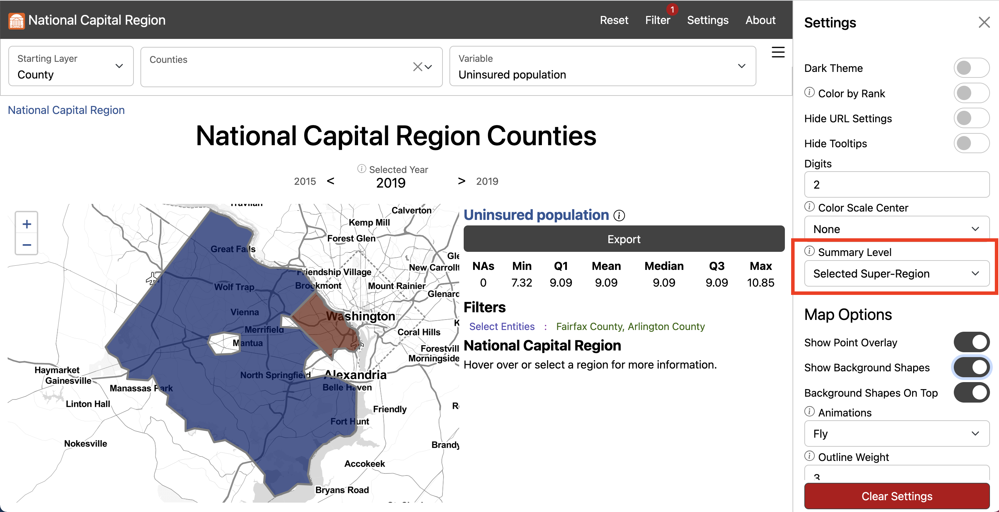

Issue overview

Our stakeholders in Fairfax county need local estimates of food insecurity to create effective policy and programs. Present measures for food insecurity, including those produced by the [Department of Agriculture](https://www.ers.usda.gov/topics/food-nutrition-assistance/food-security-in-the-u-s/) and [Feeding America](https://map.feedingamerica.org/) are not  available at sub-county geographies. Current approaches to measuring food insecurity also often do not take into account major drivers of food insecurity, including the relationship between income, household size, and the local cost of living. We saw a need, then, to devise a new approach to estimating food insecurity to inform local policy.

To build a new measure of food insecurity, we begin by calculating the cost of living in a given geographic area. Information on local cost of living, compared with local income data, helps us to understand if a household can afford to pay for food. Our model classifies households as food secure (unambiguously able pay for food), food insecure (unambiguously not able pay for food), or at-risk for food insecurity (within a range of ambiguity). We are able to produce this information at the Census tract level, providing our stakeholders with a sub-county estimate of food insecurity. 

Calculating local cost of living

Our novel method begins by calculating the local cost of living. We reviewed cost of living calculators, including 

<ul>
<li> [The Living Wage Calculator from Massachusetts Institute of Technology](https://livingwage.mit.edu/)
<li> [The Family Budget Calculator from Economic Policy Institute](https://www.epi.org/resources/budget/)
<li> [The Self Sufficiency Standard from Washington University's Center for Women's Welfare](https://selfsufficiencystandard.org/).
</ul>

We found that the available data did not meet our need of being available at the sub-county level. To construct a sub-county cost of living, we did a data discovery to find available sources for budget categories that were available at a geographically granular level and could be replicated across the National Capital Region. The table below shows the sources that were vetted and chosen for the final cost of living calculator. 

{width="800px" class="story_image"}
<figcaption> Sources used to calculate the cost of living </figcaption>

**JS NOTE graphic may not be updated? (other necessities %)**

The components represented in the final local cost of living calculator are Housing, Food, Transportation, Healthcare, Childcare, Broadband, Other Necessities, and Taxes. In our review of cost of living calculators, we found that broadband costs were often overlooked or assumed to be a standard national rate. Our calculated local cost of broadband, which extends to the Census block level, is a significant contribution to present solutions to calculating the local cost of living. We found that not all components had data sources available at Census tract level. For these components, appropriate adjustments were to bring the data to sub-county geographies.

An important component of cost of living, in addition to income, is household size and composition. We needed to take into account the number of individuals in a household, as well as their ages, to best understand their cost of living. 

Approach to measuring food insecurity

The next step to estimating food insecurity was to add the component of income. Income, along with the cost of living, allows us to understand if households have enough money to pay for food. We use microdata (person-level data) from the American Community Survey to understand the joint distribution of incomes and household sizes across the nine Public Use Microdata Areas (PUMAs) of Fairfax County. To bring this information down to the Census tract level, we use Iterative Proportional Fitting (IPF), with the marginals being the distribution of Income alone and Household Size alnone reported by the American Community Survey. This approach yields a synthetic dataset of households by Income and Household Size for each Census tract.

Bringing in our cost of living dataset, we are abe to compare the cost of living with incomes of the synthetic populations. At this stage, we can assign households as food insecure, at-risk, or food secure. Within a Census tract, then, we are able to calculate the percentage of households that are estimated to be food insecure or at-risk for food insecurity. We are also able to calculate food insecurity at the County level to compare our novel method to present measures of food insecurity. 

Findings

{width="800px" class="story_image"}
<figcaption>Data Sources: USDA, accessed 2022  
Feeding America, accessed 2022  
U.S. Department of Housing and Urban Development, accessed 2022  
Center for Neighborhood Technology, accessed 2022  
Health Insurance Market Place, accessed 2022  
Department of Labor Women's Bureau National, accessed 2022  
BroadbandNow, accessed 2022  
National Academy of Sciences accessed 2022  
National Bureau of Economic Research's program TAXSIM Version 35, accessed 2022   
    <a href = "https://uva-bi-sdad.github.io/capital_region/?selected_county=51059&selected_variable=insecure_pc_original">   Explore this measure on our dashboard </a>  
</figcaption>

Applying our methodology, we can explore food insecurity at the Census tract level in Fairfax. We find that the estimated average percentage of households facing food insecurity in Fairfax is 20 percent. Within the county, Census tracts are at a minimum 0 percent food insecure and at a maximum 58 percent food insecure. 

Census tracts with the highest percentage of the population estimated to be food insecure include southern Fairfax near Alexandria along Route 1, North Springfield, Merrifield, along Leesburg Pike near southern Arlington, western Fairfax near Dulles, and western Herndon. 

{width="400px" class="story_image"}
<figcaption width="400px">Data Sources: USDA, accessed 2022  
Feeding America, accessed 2022  
U.S. Department of Housing and Urban Development, accessed 2022  
Center for Neighborhood Technology, accessed 2022  
Health Insurance Market Place, accessed 2022  
Department of Labor Women's Bureau National, accessed 2022  
BroadbandNow, accessed 2022  
National Academy of Sciences accessed 2022  
National Bureau of Economic Research's program TAXSIM Version 35, accessed 2022   
    <a href = "https://uva-bi-sdad.github.io/capital_region/?selected_county=51059&selected_variable=at_risk_pc_original">   Explore this measure on our dashboard </a>
</figcaption>

Our methodology distinguishes households that are in a ambiguous position of being food secure: They are at-risk for food insecurity. Across Fairfax overall, 26 percent of households are at-risk of facing food insecurity. Census tracts have a miniumum of 7.8 percent at-risk households and a maximum of 100 percent. The areas with the highest percentage of households at-risk for food insecurity are in northern Fairfax, including Great Falls and McLean. 

 Explore the demographics of food insecure neighborhoods 

{width="700px" class="story_image"}
<figcaption>Data source: American Community Survey (ACS) Table B01001, accessed 2021.
    <a href = "https://uva-bi-sdad.github.io/capital_region/?plot_type=scatter&shape_type=county&selected_variable=demographics:perc_hispanic_or_latino&selected_year=2019&filter.time_min=2009&filter.time_max=2019&filter.county=51059">   Explore these measures on our dashboard </a>  
<a onclick="reveal('Fig5');"> Steps to replicate this map   </a>  

<ol>
<li> Click "Filter" in the top left navigation bar to open the Filter Window
<li> In the Filter Window under "county" select "Arlington County" and "Fairfax County"
<li> Exit the Filter Window
<li> In the Starting Layer Menu, Select "Tract"
#
<li> In the Settings Menu under Summary Level select "Selected Super-Region"
#
<li> Scroll down to Map Options and input "2" for Outline Weight and "3" for Background Outline Weight
#
<li> Exit the Settings Menu
<li> In the Variable Menu, select Asian American/Pacific Islander population under Demographics
<li> In the Variable Menu, select Black population under Demographics
<li> In the Variable Menu, select Hispanic/Latino population under Demographics
<li> In the Variable Menu, select White population under Demographics
<li> Click Export to open the Export Window and select Download to download the data locally
#
</ol>
 
</figcaption>

When we overlay patterns of food insecurity with demographics, we can see patterns in access by demographics. We see that southern Fairfax near Alexandria along Route 1 has a higher Black population as well as Hispanic/Latino population. Similarly, North Springfield, and Leesburg Pike near southern Arlington also have a higher Black population as well as Hispanic/Latino population. Merrifield, western Fairfax near Dulles, and western Herndon, which are experience higher than average food insecurity, have a higher than average Asian American/Pacific Islander population. 

Looking towards the at-risk population, which is concentrated in Great Falls and McLean, we see that these areas are made up of predominately White as well as Asian American/Pacific Islander populations.

 Exploring food insecurity with access to subsidies (SNAP) 

When we add SNAP access in our model, the percentage of households facing food insecurity falls to 19 percent. The minimum percentage of food insecure population in a Census tract is 0 percent and the maximum is 55 percent. The percentage of at-risk households is a mean of 16.7 in Census tracts, with a minimum of 16.7 percent and a maximum of 100 percent. 

Read more about the [Supplemental Nutrition Assistance Program in Fairfax County on the analysis page](https://dspg-young-scholars-program.github.io/fairfax-snap-app/background.html).

**Note:** If you find that the Social Impact Data Commons isn't displaying data properly, you may need to clear the dashboard settings (from the Settings Menu) or clear your browser cache. Please contact us if you have other issues.

`r htmltools::includeHTML("./footer.html")`
