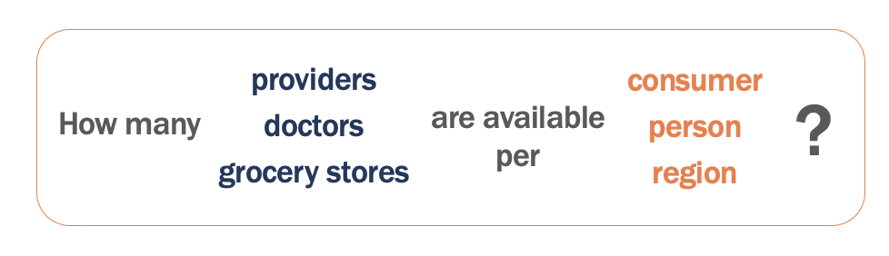
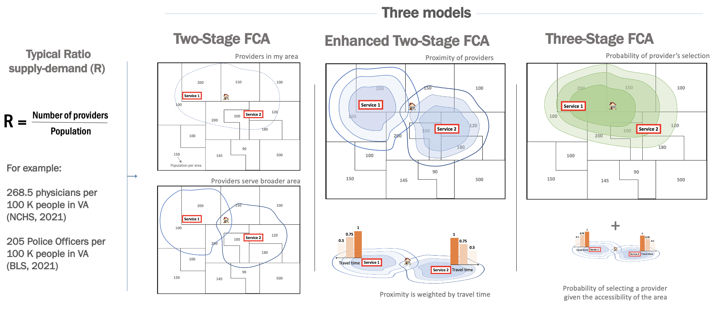

The floating catchment area (FCA) is a method that identifies spatial accessibility to a specific service, for example, hospitals, supermarkets, schools.

FCA defines the service area by a threshold travel time while accounting for the availability of physicians by their surrounded demands (Lou et al., 2003).

## Catchment package
We developed an R package to calculate spatial access and availability metrics.

Catchments (catchment areas) are regions defined by the effective range of a catching entity (or the result of its catching). For example, a basin might catch water, a hospital patients, a school students, or a store or restaurant customers. Each of these entities might have any number of conceptual catchments, such as those externally defined (like a school district), those realized (as by the origin of actual customers), and those projected (such as a travel-time radius).

[Introduction to Floating Catchment Areas](https://uva-bi-sdad.github.io/catchment/articles/introduction.html) walks through tractable examples.

[catchment_ratio](https://uva-bi-sdad.github.io/catchment/reference/catchment_ratio.html) is the main function, used to define catchments by a travel-cost matrix with bounds and/or a decay function, and calculate supply to demand ratios within them. It is a generalized implementation of a range of 2- and 3-step floating catchment area models, which is generally meant to align with those of the access Python package.
