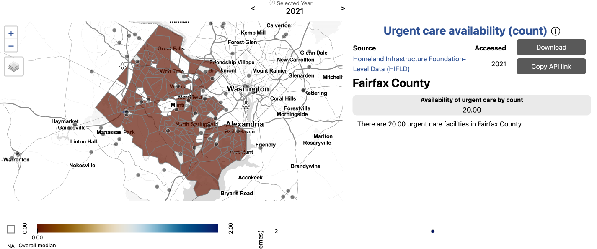
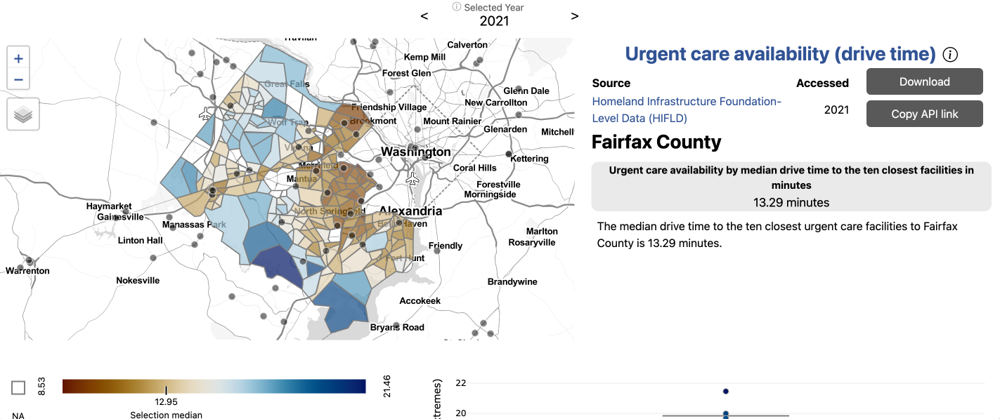
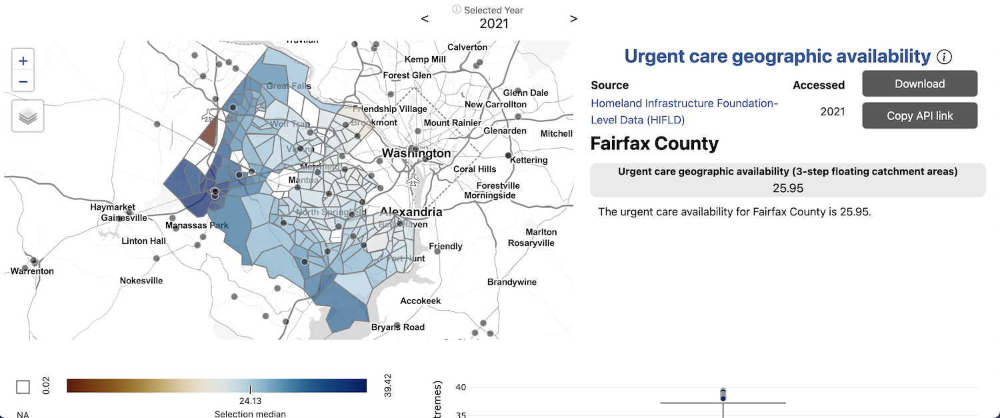
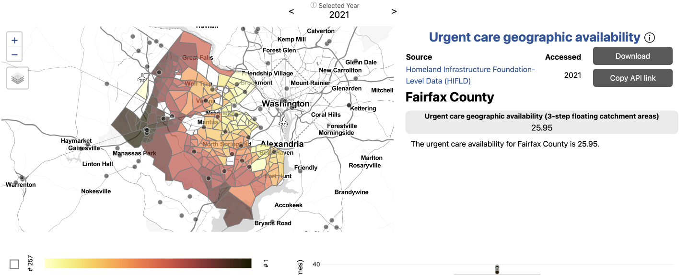
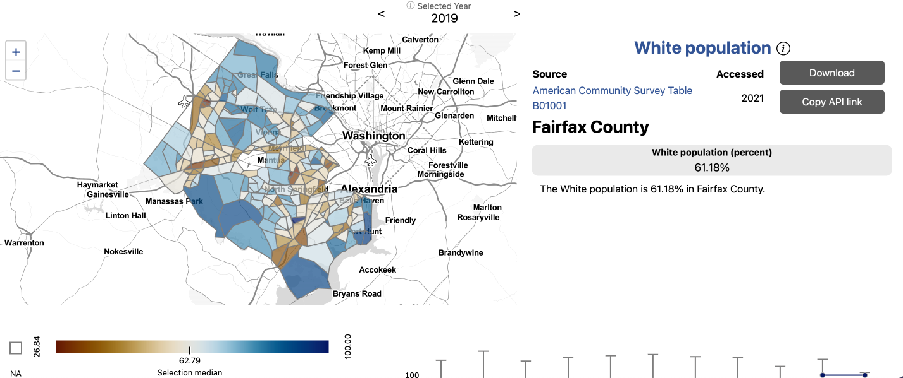
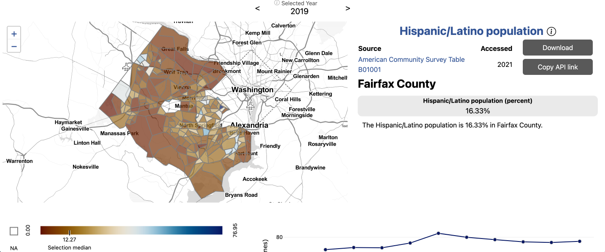

### Issue overview

Our stakeholders in Arlington and Fairfax Counties were interested in understanding the equity of access to health services by neighborhood, by race, by household income, and by housing type. We began by choosing to analyze access to urgent care facilities, gathering data from the [Homeland Security Foundation-Level Data](https://hifld-geoplatform.opendata.arcgis.com/). To get a better understanding of the idea of access, we compared several measures. 

### Where are urgent cares in Fairfax?

{width="600px" style="float: right;"}
First, we began by began by examining the locations of urgent care. We found that there are 20 urgent care facilites across the county. We calculated access to urgent care by count, or presence of an urgent care in a given geography. For most census tracts in Fairfax county, there is no urgent care present. Fairfax residents who live in a census tract without an urgent care may be able to easily drive to one nearby, though. 

### How long does it take to drive to urgent cares?

{width="600px" style="float: left;"}
The next measure of access we analyzed was drive time to the ten closest urgent care facilities. Here, we begin to see patterns of access emerge. Fairfax residents who live in more urban areas or along major roads have greater access to urgent cares by drive time. The highest average drive time to the ten closest urgent cares is over 21 minutes, while the lowest is eight minutes. Our measure of access, though, still does not take into account any population-level information.

### How do we develop a comprehensive measure of access?

{width="600px" style="float: right;"}
{width="600px" style="float: right;"}
Next, we analyzed access to urgent care by geographic availability using three-step floating catchment areas. Three-step floating catchment areas is an aggregation of facilities per population ratio weighted by travel time. Here, we see an even fuller picture access to urgent care in the region. The areas with the lowest access to urgent cares are actually those in more urban areas, where drive time is lowest. This is because while facilities are close by drive time, the population serviced by these urgent cares is so large that these residents have effectively lower access. The area with the greatest access is along a major highway in western Fairfax, bordering the relatively less-populated urban area of Manassass. 

### Is there inequity in access to urgent cares by demographics?
{width="600px" style="float: left;"}
{width="600px" style="float: left;"}
{width="600px" style="float: left;"}

After developing a comprehensive measure of access, we began to dig into the question of equity of access to urgent care facilities by demographics. We observed that the neighborhoods affected by low access to urgent cares have different demographic compositions. The Mclean neighborhood in northeast Fairfax, which is largely white and high income on average, has some of the lowest access to urgent cares in the county. The Bailey's Crossroads neighborhood, which borders Arlington in eastern Fairfax, also has some of the lowest access to urgent cares. Bailey's Crossroads is also characterized by a high Latino population and lower average household income. 

Having a comprehensive knowledge of the equity of access to urgent care within neighborhoods in Fairfax County empowers our local stakeholds to make more effective policy decisions to address and correct inequities.

