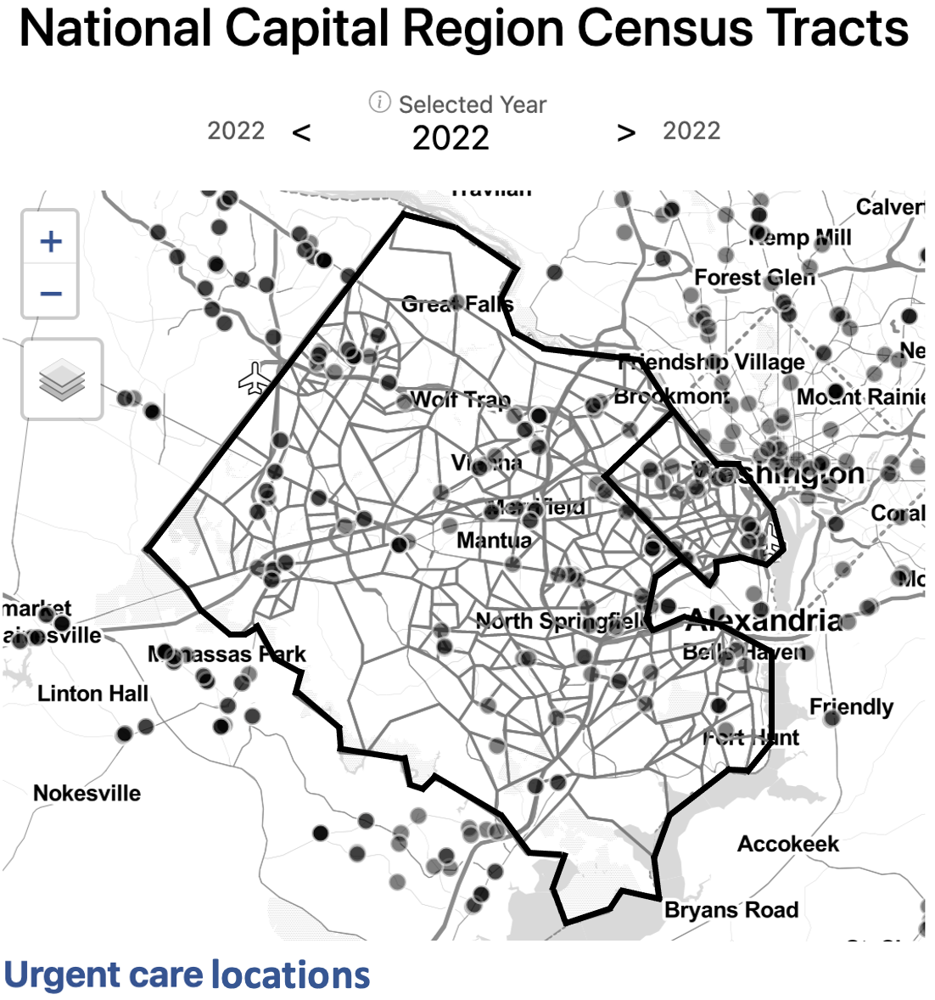
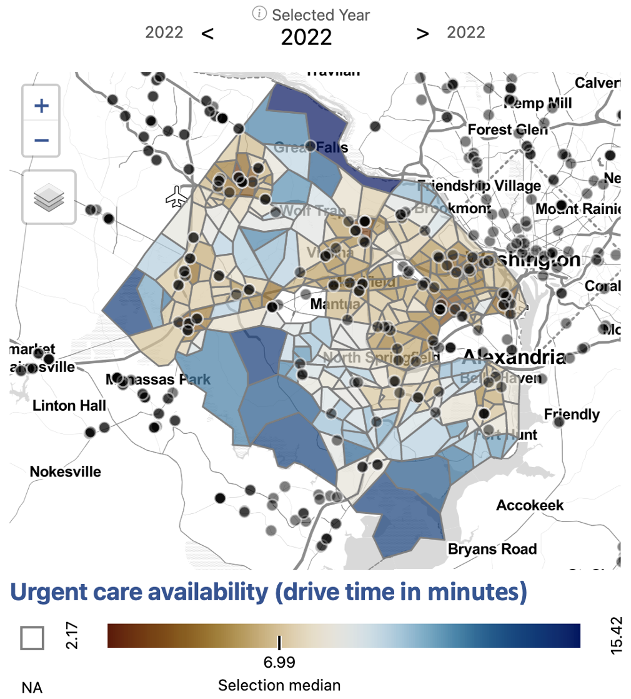
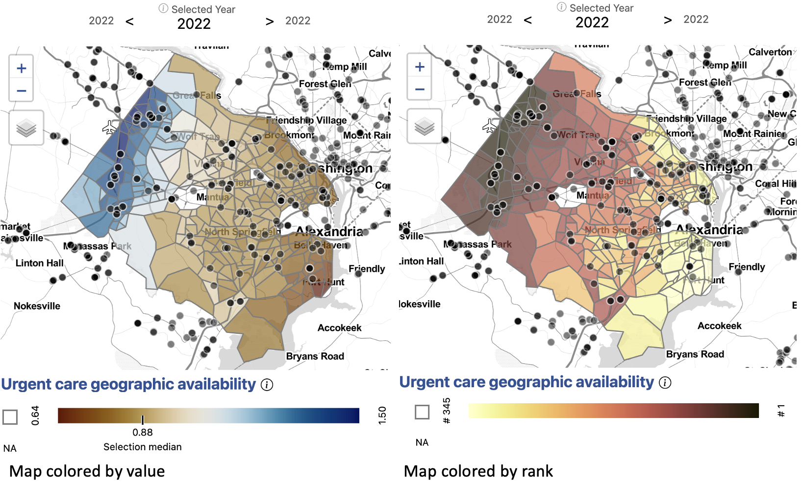
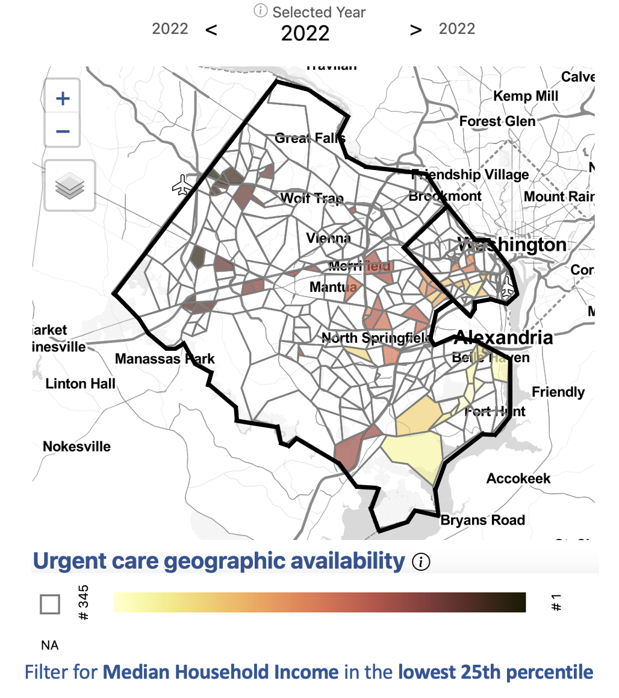
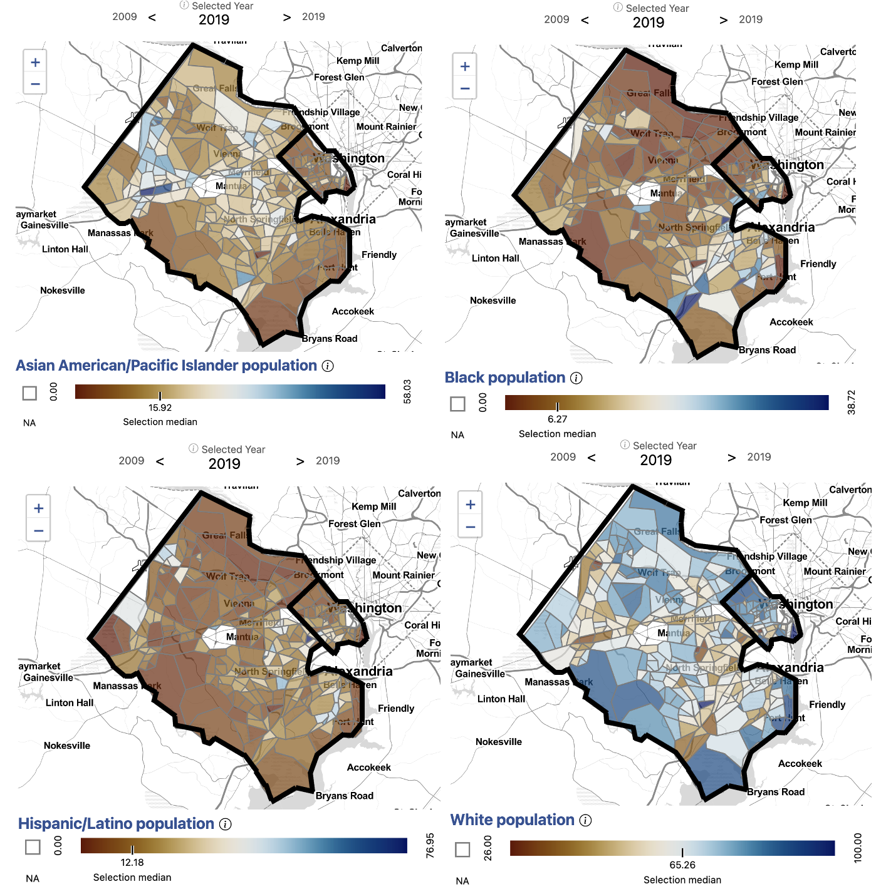
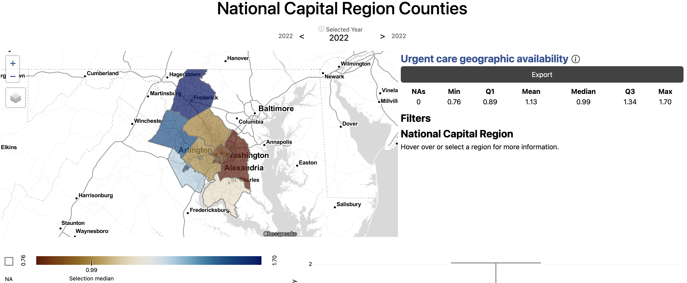

```{r, eval = FALSE, echo = FALSE, message = FALSE, warning = FALSE}
library(leaflet)
library(tidyverse)
library(sf)
library(leaflegend)

urgent <- read_csv("https://raw.githubusercontent.com/uva-bi-sdad/sdc.health/main/Health%20Care%20Services/Urgent%20Care%20Centers/Service%20Access%20Scores/data/distribution/va_hdcttrbg_hifld_2021_access_scores_urgent.csv") %>% filter(str_detect(geoid, "^51059|^51013"))
tracts <- geojsonsf::geojson_sf("https://raw.githubusercontent.com/uva-bi-sdad/sdc.geographies/main/VA/Census%20Geographies/Tract/2020/data/distribution/va_geo_census_cb_2020_census_tracts.geojson") %>% filter(str_detect(geoid, "^51059|^51013"))
counties <- geojsonsf::geojson_sf("https://raw.githubusercontent.com/uva-bi-sdad/sdc.geographies/main/VA/Census%20Geographies/County/2020/data/distribution/va_geo_census_cb_2020_counties.geojson") %>% filter(str_detect(geoid, "^51059|^51013"))
points <- geojsonio::geojson_sf("https://raw.githubusercontent.com/uva-bi-sdad/dc.hifld.urgent/master/data/points_2021.geojson")
white <- read_csv("~/git/dc.acs.demographics/data/va_hdcttr_acs_2009_2019_demographics.csv.xz") %>% filter(str_detect(geoid, "^51059|^51013"), region_type == "tract", measure == "perc_white", year == 2019) %>% left_join(tracts, by = "geoid") %>% st_as_sf()
hispanic <- read_csv("~/git/dc.acs.demographics/data/va_hdcttr_acs_2009_2019_demographics.csv.xz") %>% filter(str_detect(geoid, "^51059|^51013"), region_type == "tract", measure == "perc_hispanic_or_latino", year == 2019) %>% left_join(tracts, by = "geoid") %>% st_as_sf()
asian <- read_csv("~/git/dc.acs.demographics/data/va_hdcttr_acs_2009_2019_demographics.csv.xz") %>% filter(str_detect(geoid, "^51059|^51013"), region_type == "tract", measure == "perc_AAPI", year == 2019) %>% left_join(tracts, by = "geoid") %>% st_as_sf()

urgent <- tracts %>% left_join(urgent, by = "geoid") 

income <- read_csv("~/git/sdc.financial_well_being_dev/Pay and Benefits/Household Income/data/distribution/va_cttrbg_2015_2019_median_household_income.csv.xz") %>% mutate(geoid = as.character(geoid)) %>% filter(str_detect(geoid, "^51059|^51013"), region_type == "tract", measure == "median_household_income", year == 2019) %>% left_join(tracts, by = "geoid") %>% st_as_sf()

#devtools::install_github("thomasp85/scico")
library(scico)
```


<style type="text/css">
  h1.title {
    text-align: center;
    margin-bottom: -3px;
  }
  h3.subtitle {
    text-align: center;
  }
</style>

<div style="clear: both">

```{css float-right-figure-caption, echo = FALSE}
.my-right-figure {
  display: table;
  float: right;
  padding-left: 30px;
  padding-bottom: 10px;
}
.my-right-figure p {
  display: table-caption;
  caption-side: bottom;
  padding-left: 30px
}
.figure {
  display: contents;
}
```

```{css float-left-figure-caption, echo = FALSE}
.my-left-figure {
  display: table;
  float: left;
  padding-right: 30px;
  padding-bottom: 10px;
}
.my-left-figure p {
  display: table-caption;
  caption-side: bottom;
  padding-right: 30px
}
.figure {
  display: contents;
}
```
<hr />
<div class="section_header">Issue overview</div>

<div class="section_text"> Our partners in Arlington and Fairfax Counties were interested in understanding the equity of access to health services by neighborhood, by race, by household income, and by housing type. We began analyzing access to urgent care facilities. 

We inventoried a variety of urgent care location data sources for accuracy and quality. Given that urgent care is a rapidly growing health care service, we found that administrative datasets were incomplete by a wide margin. We found that [Google Maps](https://maps.google.com/) provided the most complete picture of urgent care facility locations in the Capital Region. To get a better understanding of the idea of access, we compared several measures.</div>

<div class="section_header">Where are urgent cares in Arlington and Fairfax?</div>

<div class="section_text">
```{r, eval = FALSE, results='asis', echo = FALSE, fig.width=5.5, fig.height=4}
cat('<div width="600px" style="float: right;">')
plot <- urgent %>% filter(measure == "urgent_cnt")

pal <- colorNumeric(
  palette = scico(30, palette = 'vik'),
  domain = plot$value,
  na.color = NA
)

plot %>% 
leaflet() %>%
  addProviderTiles(providers$CartoDB.Positron) %>%
  addPolygons(color = ~pal(value), weight = 1,
                opacity = 1.0, fillOpacity = .8, popup = paste0("Census Tract ", plot$geoid, " : ", round(plot$value, 1), " urgent cares")) %>%
  addCircleMarkers(data = points, fillOpacity = 1, fillColor = "#FFFFFF", color = "#000000",
             stroke = TRUE, radius = 5, opacity = 1, weight = 2) %>%
  addPolylines(data = counties, opacity = 1, color = "#000000") %>%
  addLegendNumeric(position = "bottomleft", pal = pal, values = ~value, orientation = "horizontal",
            title = "Urgent care availability (count)", height = 20, width = 200) %>%
  setView(lng = -77.3, lat = 38.85, zoom = 9.5)

cat('<caption>Data source: Homeland Infrastructure Foundation-Level Data, accessed 2021.
    <a href = "https://uva-bi-sdad.github.io/capital_region/?plot_type=scatter&shape_type=county&selected_variable=access_scores_urgent:urgent_cnt&selected_year=2021&filter.time_min=2021&filter.time_max=2021&filter.county=51013,51059"> <br> Explore this measure on our dashboard </a> </caption>')

cat('</div>')
```


{width="400px" style="float: right; border: 1px solid #232d4b; box-shadow: 5px 5px 3px lightblue; margin:15px 15px 25px 15px;"}

First, we began by examining the locations of urgent care.<br /><br /> <blockquote> <strong>There are 113 urgent care facilities in Fairfax and 18 facilities in Arlington.</strong> </blockquote> By number of facilities, Fairfax has the greatest access to urgent care in the National Capital region. We calculated access to urgent care by count, or presence of an urgent care in a given geography. For most census tracts, there is no urgent care present. Fairfax and Arlington residents who live in a census tract without an urgent care may be able to easily drive to one nearby, though.</div>

</div>

<div style="clear: both">


<div class="section_header">How long does it take to drive to urgent cares?</div>

<div class="section_text">
```{r, eval = FALSE, results='asis', echo = FALSE, fig.width=5.5, fig.height=4}
cat('<div width="600px" style="float: left;">')
plot <- urgent %>% filter(measure == "urgent_near_10_median")

pal <- colorNumeric(
  palette = scico(30, palette = 'vik'),
  domain = plot$value,
  na.color = NA
)

plot %>% 
leaflet() %>%
  addProviderTiles(providers$CartoDB.Positron) %>%
  addPolygons(color = ~pal(value), weight = 1,
                opacity = 1.0, fillOpacity = .8, popup = paste0("Census Tract ", plot$geoid, " : ", round(plot$value, 1), " minutes")) %>%
  addCircleMarkers(data = points, fillOpacity = 1, fillColor = "#FFFFFF", color = "#000000",
             stroke = TRUE, radius = 5, opacity = 1, weight = 2) %>%
  addPolylines(data = counties, opacity = 1, color = "#000000") %>%
  addLegendNumeric(position = "bottomleft", pal = pal, values = ~value, orientation = "horizontal",
            title = "Urgent care availability (drive time)", height = 20, width = 200) %>%
  setView(lng = -77.3, lat = 38.85, zoom = 9.5)

cat('<caption>Data source: Homeland Infrastructure Foundation-Level Data, accessed 2021. <br> 
Drive times calculated using Open Street Routing Machine.
    <a href = "https://uva-bi-sdad.github.io/capital_region/?plot_type=scatter&shape_type=county&selected_variable=access_scores_urgent:urgent_near_10_median&selected_year=2021&filter.time_min=2021&filter.time_max=2021&filter.county=51013,51059"> <br> Explore this measure on our dashboard </a> </caption>')

cat('</div>')
```

{width="400px" style="float: left; border: 1px solid #232d4b; box-shadow: 5px 5px 3px lightblue; margin:15px 15px 25px 15px;"}

The next measure of access we analyzed was drive time to the ten closest urgent care facilities. Here, we begin to see patterns of access emerge. <br /><br /><strong><blockquote> Fairfax and Arlington residents who live in more urban areas, along major roads, or in Metro corridors, have greater access to urgent cares by drive time. </blockquote></strong> In Fairfax, the highest average drive time to the ten closest urgent cares is over 15 minutes, while the lowest is three minutes. Across Arlington, it can take as much as nine minutes to drive to the closest urgent care and and as little two minutes. In both these counties, geographic inequities exist in access to urgent care. Our measure of access, though, still does not take into account any population-level information.</div>

<div style="clear: both">


<div class="section_header">How do we develop a comprehensive measure of access?</div>

<div class="section_text">
```{r, eval = FALSE, results='asis', echo = FALSE, fig.width=5.5, fig.height=4}
cat('<div width="500px" style="float: right;">')
plot <- urgent %>% filter(measure == "urgent_3sfca")

pal <- colorNumeric(
  palette = scico(30, palette = 'vik'),
  domain = plot$value,
  na.color = NA
)

plot %>% 
leaflet() %>%
  addProviderTiles(providers$CartoDB.Positron) %>%
  addPolygons(color = ~pal(value), weight = 1,
                opacity = 1.0, fillOpacity = .8, popup = paste0("Census Tract ", plot$geoid, " : ", round(plot$value, 1))) %>%
  addCircleMarkers(data = points, fillOpacity = 1, fillColor = "#FFFFFF", color = "#000000",
             stroke = TRUE, radius = 5, opacity = 1, weight = 2) %>%
  addPolylines(data = counties, opacity = 1, color = "#000000") %>%
  addLegendNumeric(position = "bottomleft", pal = pal, values = ~value, orientation = "horizontal",
            title = "Urgent care geographic availability", height = 20, width = 200) %>%
  setView(lng = -77.3, lat = 38.85, zoom = 9.5)

plot <- urgent %>% filter(measure == "urgent_3sfca") %>% arrange(-value) %>% rownames_to_column() %>% mutate(value = as.numeric(rowname))

palrank <- colorNumeric(
  palette = scico(30, palette = 'lajolla'),
  domain = plot$value,
  na.color = NA
)

plot %>% 
leaflet() %>%
  addProviderTiles(providers$CartoDB.Positron) %>%
  addPolygons(color = ~palrank(value), weight = 1,
                opacity = 1.0, fillOpacity = .8, popup = paste0("Census Tract ", plot$geoid, " : ", round(plot$value, 1))) %>%
  addCircleMarkers(data = points, fillOpacity = 1, fillColor = "#FFFFFF", color = "#000000",
             stroke = TRUE, radius = 5, opacity = 1, weight = 2) %>%
  addPolylines(data = counties, opacity = 1, color = "#000000") %>%
    addLegendNumeric(position = "bottomleft", pal = palrank, values = ~value, orientation = "horizontal",
            title = "Urgent care geographic availability (rank)", height = 20, width = 200) %>%
  setView(lng = -77.3, lat = 38.85, zoom = 9.5)

cat('<caption>Data source: Homeland Infrastructure Foundation-Level Data, accessed 2021. <br> 
Population data from the American Community Survey (ACS). <br>
Drive times calculated using Open Street Routing Machine. 
    <a href = "https://uva-bi-sdad.github.io/capital_region/?plot_type=scatter&shape_type=county&selected_variable=access_scores_urgent:urgent_3sfca&selected_year=2021&filter.time_min=2021&filter.time_max=2021&filter.county=51013,51059"> <br> Explore this measure on our dashboard </a> </caption>')

cat('</div>')
```

<div style = "text-align: center">
{width="700px" style="border: 1px solid #232d4b; box-shadow: 5px 5px 3px lightblue; margin:15px 15px 25px 15px;"}
</div>

Next, we analyzed access to urgent care by geographic availability using three-step floating catchment areas. Three-step floating catchment areas is an aggregation of facilities per population ratio weighted by travel time. Here, we see an even fuller picture access to urgent care in the region. <br /><br /><strong><blockquote> In Fairfax the areas with the lowest access to urgent cares are the southwestern neighborhoods, including Fort Hunt and Huntington, and northern McLean. </blockquote></strong> <strong><blockquote> In Arlington, northern neighborhoods near Marymount University and southern neighbhorhoods below Columbia Pike have the lowest access. </blockquote></strong> These areas have relatively high populations given the proximity of urgent cares. The area with the greatest access is Centreville, Chantilly, and Herndon, which lie along a major roads in western Fairfax and have a relatively high number of urgent cares for the population. Bailey's Crossroads and Annandale also have comparatively low access for the region.


{width="400px" style="float: left; border: 1px solid #232d4b; box-shadow: 5px 5px 3px lightblue; margin:15px 15px 25px 15px;"}

Applying filters to our dataset can help us zero in on populations and neighbhorhoods of interest. In this case, we filter for census tracts with a median household income in the lowest 25th percentile (below $101,838). We can see that some census tracts with low median household income are well served by urgent cares, particularly in western Fairfax near Centreville, Chanilly, and Herndon. <strong><blockquote> Many census tracts, such as those in southern Arlington, Annandale, Bailey's Crossroads, and near Fort Hunt, have both a relatively low median household income and a relatively low access to urgent care. </blockquote></strong></div>

<div style="clear: both">


<div class="section_header">Is there inequity in access to urgent cares by demographics?</div>

<div class="section_text">
```{r, eval = FALSE, results='asis', echo = FALSE, fig.width=5.5, fig.height=4}
cat('<div width="600px" style="float: left;">')

pal2 <- colorNumeric(
  palette = scico(30, palette = 'vik'),
  domain = c(0,100),
  na.color = NA
)

plot %>% 
leaflet() %>%
  addProviderTiles(providers$CartoDB.Positron) %>%
  addPolygons(color = ~palrank(value), weight = 1,
                opacity = 1.0, fillOpacity = .8, popup = paste0("Census Tract ", plot$geoid, " : ", round(plot$value, 1))) %>%
  addCircleMarkers(data = points, fillOpacity = 1, fillColor = "#FFFFFF", color = "#000000",
             stroke = TRUE, radius = 5, opacity = 1, weight = 2) %>%
  addPolylines(data = counties, opacity = 1, color = "#000000") %>%
  addLegendNumeric(position = "bottomleft", pal = palrank, values = ~value, orientation = "horizontal",
            title = "Urgent care geographic availability (rank)", height = 20, width = 200) %>%
  setView(lng = -77.3, lat = 38.85, zoom = 9.5)

hispanic %>% 
leaflet() %>%
  addProviderTiles(providers$CartoDB.Positron, group = "Base") %>%
  addPolygons(color = ~pal2(value), weight = 1,
                opacity = 1.0, fillOpacity = .8, popup = paste0("Census Tract ", hispanic$geoid, " : ", round(hispanic$value, 1), " percent Hispanic/Latino"), group = "Hispanic/Latino") %>%
  addPolygons(data = white, color = ~pal2(value), weight = 1,
                opacity = 1.0, fillOpacity = .8, popup = paste0("Census Tract ", white$geoid, " : ", round(white$value, 1), " percent White"), group = "White") %>%
  addPolygons(data = asian, color = ~pal2(value), weight = 1,
                opacity = 1.0, fillOpacity = .8, popup = paste0("Census Tract ", asian$geoid, " : ", round(asian$value, 1), " percent Asian American/Pacific Islander"), group = "Asian American/Pacific Islander") %>%
  addPolylines(data = counties, opacity = 1, color = "#000000") %>%
    addLegendNumeric(position = "bottomleft", pal = pal2, values = c(0,100), orientation = "horizontal",
            title = "Overlay population (percent)", height = 20, width = 200, group = "Base") %>%
  setView(lng = -77.3, lat = 38.85, zoom = 9.5) %>%
    addLayersControl(
    baseGroups = c("Hispanic/Latino", "Asian American/Pacific Islander", "White"),
    options = layersControlOptions(collapsed = FALSE)
  ) %>%
    addCircleMarkers(data = points, fillOpacity = 1, fillColor = "#FFFFFF", color = "#000000",
             stroke = TRUE, radius = 5, opacity = 1, weight = 2)

pal <- colorNumeric(
  palette = scico(30, palette = 'vik'),
  domain = income$value,
  na.color = NA
)

income %>% 
  leaflet() %>%
  addProviderTiles(providers$CartoDB.Positron, group = "Base") %>%
  addPolygons(color = ~pal(value), weight = 1, opacity = 1.0, fillOpacity = .8, popup = paste0("Census Tract ", income$geoid, " : $", round(income$value, 1), " median household income"), group = "Household Income") %>%
  addPolylines(data = counties, opacity = 1, color = "#000000") %>%
  addLegendNumeric(position = "bottomleft", pal = pal, values = ~value, orientation = "horizontal",
                   title = "Median household income", height = 20, width = 200, group = "Base") %>%
  setView(lng = -77.3, lat = 38.85, zoom = 9.5) %>%
  addLayersControl(
    baseGroups = c("Household Income"),
    options = layersControlOptions(collapsed = FALSE)
    ) %>%
  addCircleMarkers(data = points, fillOpacity = 1, fillColor = "#FFFFFF", color = "#000000",
                   stroke = TRUE, radius = 5, opacity = 1, weight = 2)

cat('<caption>Data source: Demographic and income data from the American Community Survey <br> (ACS). 
    <a href = "https://uva-bi-sdad.github.io/capital_region/?plot_type=scatter&shape_type=county&selected_variable=demographics:perc_hispanic_or_latino&selected_year=2019&filter.time_min=2009&filter.time_max=2019&filter.county=51013,51059"> <br> Explore these measures on our dashboard </a> </caption>')

cat('</div>')
```

<center>Demographics and Income mapped in Fairfax and Arlington</center>
```{r, echo=FALSE, include = FALSE, eval = FALSE}
htmltools::includeHTML("urgent-demographic_gallery.html")
```
<div style = "text-align: center">
{width="700px" style="border: 1px solid #232d4b; box-shadow: 5px 5px 3px lightblue; margin:15px 15px 15px 15px;"}
</div>

After developing a comprehensive measure of access, we began to dig into the question of equity of access to urgent care facilities by demographics. We observed that the neighborhoods affected by low access to urgent cares have different demographic compositions.

Northern Arlington, where the population is largely white and high income on average, has some of the lowest access to urgent cares in the region. 

The Southern Arlington and neighboring Bailey's Crossroads and Annandale in Fairfax have higher Hispanic/Latino populations and lower income on average. These areas also have relatively low access to urgent cares. Bailey's Crossroads is also characterized by a high Latino population and lower average household income. 

Centreville, McLean, and Tyson's Corner have larger Asian American/Pacific Islander populations. Centreville has some of the highest access to urgent care in the region while McLean has some of the lowest access.

Some census tracts in Huntington and Fort Hunt have higher than average Black populations and lower than average household income. These areas are also the most underserved in access to urgent care.

In addition to income and demographic variables, we could explore access to urgent care by additional factors affecting health equity, including primary language spoken at home or access to health insurance. 

Having a comprehensive knowledge of the equity of access to urgent care within neighborhoods in Fairfax and Arlington counties empowers our local stakeholders to make more effective policy decisions to address and correct inequities.</div>

<div style="clear: both">


[//]: # ### How does access to urgent care compare to the National Capital Region?

[//]: # <div width="500px" style="float: right;">

[//]: # </div>

[//]: # {width="600px" style="float: right;"}
[//]: # Although Fairfax has the largest number of urgent cares in the Capital Region, it falls near the average level of access to urgent cares by floating catchment area. 

[//]: # Arlington ranks in the bottom 25 percent of counties for access to urgent care. 

[//]: # </div>

[//]: # <div style="clear: both">

[//]: # <br>
[//]: # <br>


<div class="section_header">Exploring access to additional health services</div>

<div class="section_text">

```{r, eval = FALSE, results='asis', echo = FALSE, fig.width=5.5, fig.height=4, message = FALSE}
cat('<div width="600px" style="float: right;">')

hospital <- read_csv("https://github.com/uva-bi-sdad/sdc.health/raw/main/Health%20Care%20Services/Hospitals%20and%20Emergency%20Rooms/Service%20Access%20Scores/data/distribution/va_hdcttrbg_hifld_2021_access_scores_hospitals.csv") %>% filter(str_detect(geoid, "^51059|^51013"), region_type == "tract", measure == "hosp_e2sfca", year == 2021) %>% left_join(tracts, by = "geoid") %>% st_as_sf()

doctors <- read_csv("https://github.com/uva-bi-sdad/sdc.health/raw/main/Health%20Care%20Services/Physicians/Primary%20Care/Service%20Access%20Scores/data/distribution/va_hdcttrbg_webmd_2021_access_scores_primcare.csv") %>% filter(str_detect(geoid, "^51059|^51013"), region_type == "tract", measure == "primcare_e2sfca", year == 2021) %>% left_join(tracts, by = "geoid") %>% st_as_sf()

drug <- read_csv("https://github.com/uva-bi-sdad/sdc.health/raw/main/Health%20Care%20Services/Drug%20and%20Rehab/Service%20Catchment%20Scores/data/distribution/va_hdcttrbg_samhsa_2021_access_scores_substance.csv") %>% filter(str_detect(geoid, "^51059|^51013"), region_type == "tract", measure == "subs_e2sfca", year == 2021) %>% left_join(tracts, by = "geoid") %>% st_as_sf()

pal <- colorNumeric(
  palette = scico(30, palette = 'vik'),
  domain = hospital$value,
  na.color = NA
)

pal2 <- colorNumeric(
  palette = scico(30, palette = 'vik'),
  domain = doctors$value,
  na.color = NA
)

pal3 <- colorNumeric(
  palette = scico(30, palette = 'vik'),
  domain = drug$value,
  na.color = NA
)

hospital %>% 
leaflet() %>%
  addProviderTiles(providers$CartoDB.Positron, group = "Base") %>%
  addPolygons(color = ~pal(value), weight = 1,
                opacity = 1.0, fillOpacity = .8, popup = paste0("Census Tract ", hospital$geoid, " : ", round(hospital$value, 1), " hospital access"), group = "Hospitals") %>%
  addPolygons(data = doctors, color = ~pal2(value), weight = 1,
                opacity = 1.0, fillOpacity = .8, popup = paste0("Census Tract ", doctors$geoid, " : ", round(doctors$value, 1), " primary care access"), group = "Primary Care") %>%
  addPolygons(data = drug, color = ~pal3(value), weight = 1,
                opacity = 1.0, fillOpacity = .8, popup = paste0("Census Tract ", drug$geoid, " : ", round(drug$value, 1), " substance use facility access"), group = "Substance Use Facilities") %>%
  addPolylines(data = counties, opacity = 1, color = "#000000") %>%
    addLegendNumeric(position = "bottomleft", pal = pal2, values = ~doctors$value, orientation = "horizontal",
            title = "Health service access", height = 20, width = 200, group = "Base") %>%
  setView(lng = -77.3, lat = 38.85, zoom = 9.5) %>%
    addLayersControl(
    baseGroups = c("Hospitals", "Primary Care", "Substance Use Facilities"),
    options = layersControlOptions(collapsed = FALSE)
  ) 

cat('<caption>Data source: Hospital data from Homeland Infrastructure Foundation-Level Data, <br> accessed 2021. <br> Primary care physician data from WebMD, accessed 2021. <br> Substance Use Facilities from Substance Abuse and Mental Health Services <br> Administration, accessed 2021.  
    <a href = "https://uva-bi-sdad.github.io/capital_region/?plot_type=scatter&shape_type=county&selected_variable=access_scores_primcare:primcare_e2sfca&selected_year=2021&filter.time_min=2021&filter.time_max=2021&filter.county=51013,51059"> Explore these measures on our dashboard </a> </caption>')

cat('</div>')
```
Using the Social Impact Data Commons, we can explore access to additional health services using an equity lens. For example, we can explore differences in access to hospitals, primary care physicians, or substance use facilities. We find that access to these services across Fairfax and Arlington do not necessarily follow the same pattern. Using specific measures, policymakers can make informed decisions to address specific health equity gaps. 

</div>


