<script> 
function reveal(id) {
  var e = document.getElementById(id);
  if (e.style.display == 'inline') {
    e.style.display = 'none';
  } else {
    var allTexts = document.querySelectorAll(".hiddenText");
    for (var i = 0, len = allTexts.length; i < len; i++) {
      allTexts[i].style.display = 'none';
    }
    e.style.display = 'inline';
  }
}
</script>

---
title: "Health Equity in the National Capital Region"
subtitle: "Is access to urgent care health services equitable in Arlington and Fairfax County?"
---

<div style="clear: both">

<hr />
<div class="section_header">Issue overview</div>

<div class="section_text"> Our partners in Arlington and Fairfax Counties were interested in understanding the equity of access to health services by neighborhood, by race and ethnicity, and by household income. We began analyzing access to urgent care health services facilities. 

We inventoried a variety of urgent care health services location data sources for accuracy and quality. Given that urgent care health services is a rapidly growing health care service, we found that administrative datasets were incomplete. We found that [Google Maps](https://maps.google.com/) provided the most complete picture of urgent care health services locations in the National Capital Region. To get a better understanding of the idea of access, we compared several measures.</div>

<div class="section_header">Where are urgent care health services in Arlington and Fairfax?</div>

<div class="section_text">

<div style="float: right;">
<figcaption> Exhibit 1. Urgent Care Health Services Locations in Arlington and Fairfax Counties by Census Tract, 2022. </figcaption>
{width="400px" class="story_image"}
<figcaption style="width:400px;"> Data source: Google Maps, accessed 2022 <a href = "https://uva-bi-sdad.github.io/capital_region/?plot_type=scatter&shape_type=county&selected_variable=access_scores_urgent:urgent_cnt&selected_year=2021&filter.time_min=2021&filter.time_max=2021&filter.county=51013,51059"> <br> Explore this measure on our dashboard </a> <br>
<a onclick="reveal('Fig1');"> Steps to replicate this map <br> </a>  
<span class="hiddenText" id="Fig1">
<ol>
<li> Click "Filter" in the top left navigation bar to open the Filter Window
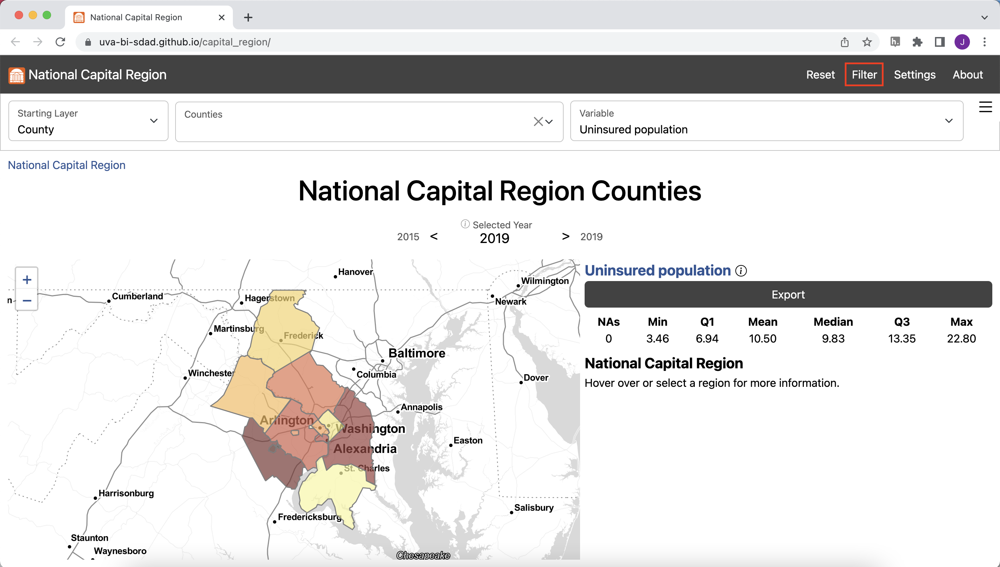
<li> In the Filter Window under "county" select "Arlington County" and "Fairfax County"
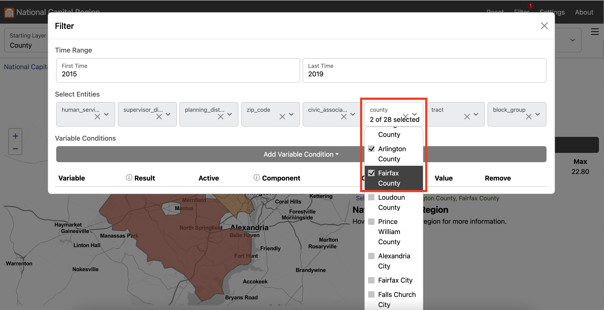
<li> Exit the Filter Window
<li> In the Starting Layer Menu, Select "Tract"
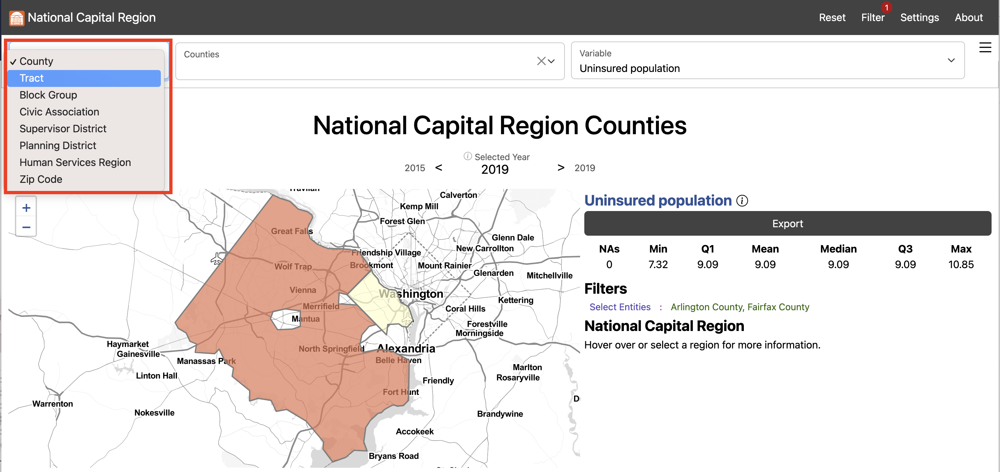
<li> In the Settings Menu, scroll down to Map Options
<li> Input "2" for Outline Weight and "3" for Background Outline Weight
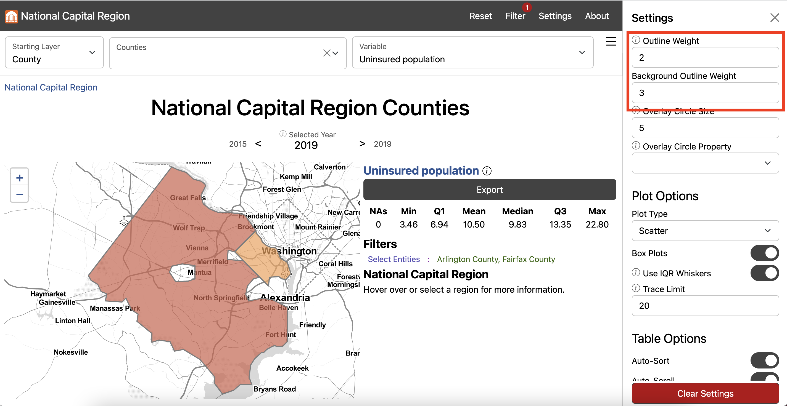
<li> Exit the Settings Menu
<li> In the Variable Menu, select urgent care health services geographic (count) under Health
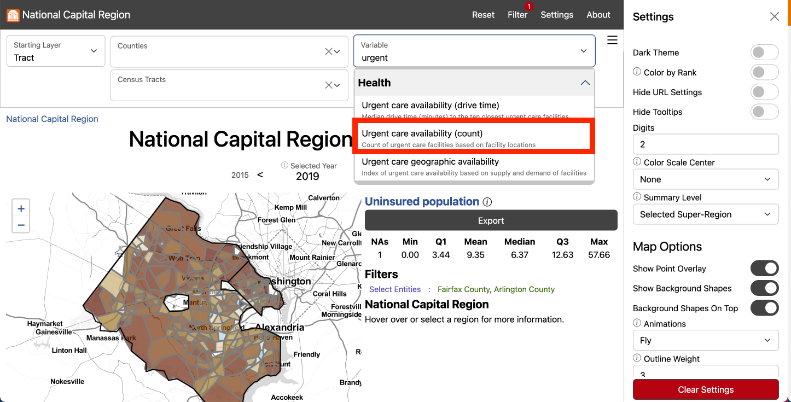
<li> Click Export to open the Export Window and select Download to download the data locally
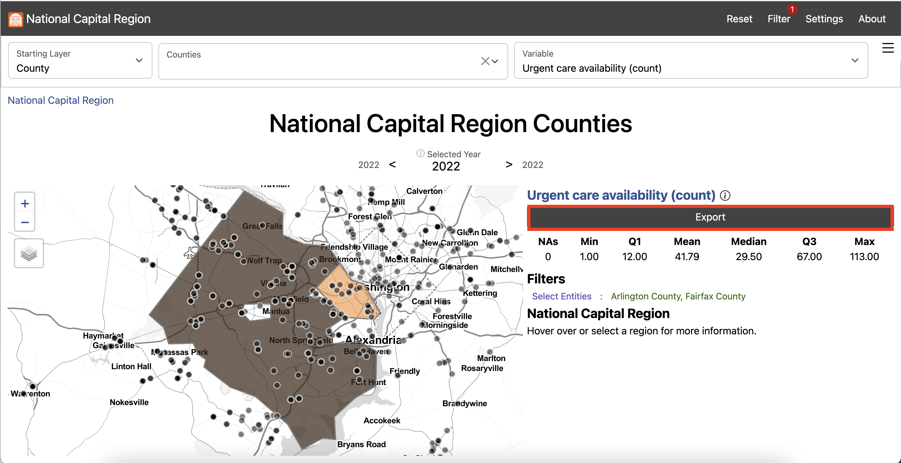
</ol>
</span>
</figcaption>
</div>

First, we began by examining the locations of urgent care health services health service facilities, shown in Exhibit 1.<br /><br /> <blockquote> <strong>There are 113 urgent care health services health service facilities in Fairfax and 18 in Arlington.</strong> </blockquote> By number of facilities, Fairfax has the greatest access to urgent care health services in the National Capital region. This would be expected given the Fairfax County population is almost 5 times larger than Arlington County according to the 2020 Census. Fairfax County is also over 15 times larger by geographic area than Arlington County. We also calculated presence of urgent care health services by Census tract. For most census tracts, there is no urgent care health services facility present. Fairfax and Arlington residents who live in a census tract without an urgent care health services facility may be able to easily drive to one nearby. </div>

</div>

<div style="clear: both">


<div class="section_header">How long does it take to drive to urgent care health services?</div>

<div class="section_text">

<div style="float: left">
<figcaption> Exhibit 2. Urgent Care Health Services Availability by Drive Time (Minutes) in Arlington and Fairfax Counties by Census Tract, 2022. </figcaption>
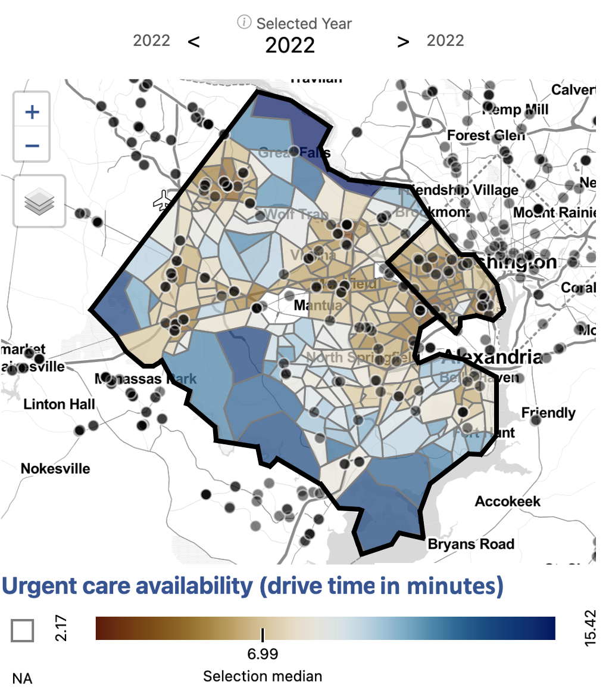{width="400px" class="story_image"}
<figcaption style="width:400px;">Data source: Google Maps, accessed 2022. <br> 
Drive times calculated using Open Source Routing Machine.
    <a href = "https://uva-bi-sdad.github.io/capital_region/?plot_type=scatter&shape_type=county&selected_variable=access_scores_urgent:urgent_near_10_median&selected_year=2021&filter.time_min=2021&filter.time_max=2021&filter.county=51013,51059"> <br> Explore this measure on our dashboard </a> <br>
<a onclick="reveal('Fig2');"> Steps to replicate this map <br> </a>  
<span class="hiddenText" id="Fig2">
<ol>
<li> Click "Filter" in the top left navigation bar to open the Filter Window

<li> In the Filter Window under "county" select "Arlington County" and "Fairfax County"
[](img/tutorial-filter_menu_counties.png)
<li> Exit the Filter Window
<li> In the Starting Layer Menu, Select "Tract"

<li> In the Settings Menu under Summary Level select "Selected Super-Region"
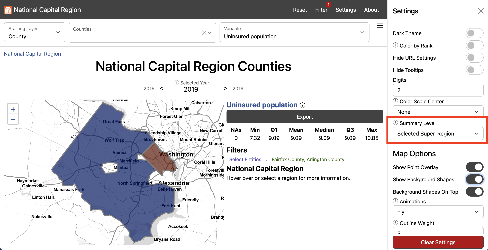
<li> Scroll down to Map Options and input "2" for Outline Weight and "3" for Background Outline Weight

<li> Exit the Settings Menu
<li> In the Variable Menu, select urgent care health services availability (drive time) under Health
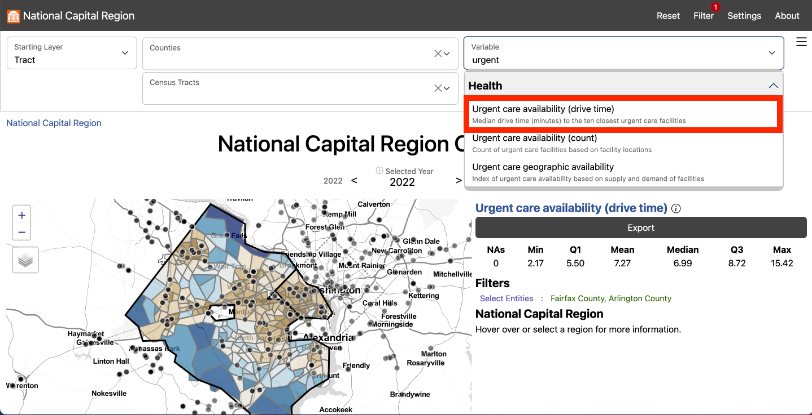
<li> Click Export to open the Export Window and select Download to download the data locally

</ol>
</span>
</figcaption>
</div>    
  
The next measure of access we analyzed was drive time to the ten closest urgent care health services facilities, shown in Exhibit 2. Here, we begin to see patterns of access emerge. <br /><br /><strong><blockquote> Fairfax and Arlington residents who live in more urban areas, along major roads, or in Metro corridors, have greater access to urgent care health services by drive time. </blockquote></strong> In Fairfax, the range of drive time to the ten closest urgent care health services facilities is three to over 15 minutes. Across Arlington, the range of drive time to the ten closest urgent care health service facilities is two to nine minutes. In both these counties, geographic inequities exist in access to urgent care health services. Our measure of access, though, still does not take into account any population-level information.</div>

<div style="clear: both">


<div class="section_header">How do we develop a comprehensive measure of access?</div>

<div class="section_text">

<div style="text-align: center">
<figcaption> Exhibit 3. Value of 3-Step Floating Catchment Areas for Urgent Care Health Services Access in Arlington and Fairfax Counties by Census Tract, 2022 (Left), Rank of 3-Step Floating Catchment Areas for Urgent Care Health Services Access in Arlington and Fairfax Counties by Census Tract, 2022 (Right)</figcaption>
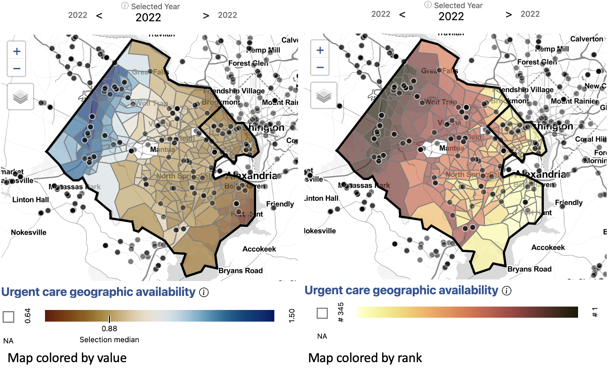{width="700px" class="story_image"}
<figcaption> Data source: Google Maps, accessed 2022. <br> 
Population data from the American Community Survey (ACS). <br>
Drive times calculated using Open Source Routing Machine. 
    <a href = "https://uva-bi-sdad.github.io/capital_region/?plot_type=scatter&shape_type=county&selected_variable=access_scores_urgent:urgent_3sfca&selected_year=2021&filter.time_min=2021&filter.time_max=2021&filter.county=51013,51059"> <br> Explore this measure on our dashboard </a> <br>
<a onclick="reveal('Fig3');"> Steps to replicate this map <br> </a>  
<span class="hiddenText" id="Fig3">
<ol>
<li> Click "Filter" in the top left navigation bar to open the Filter Window

<li> In the Filter Window under "County" select "Arlington County" and "Fairfax County"

<li> Exit the Filter Window
<li> In the Starting Layer Menu, Select "Tract"

<li> In the Settings Menu under Summary Level select "Selected Super-Region"

<li> Scroll down to Map Options and input "2" for Outline Weight and "3" for Background Outline Weight
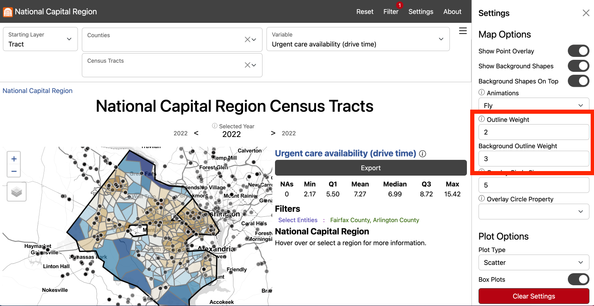
<li> Exit the Settings Menu
<li> In the Variable Menu, select urgent care health services geographic availability under Health
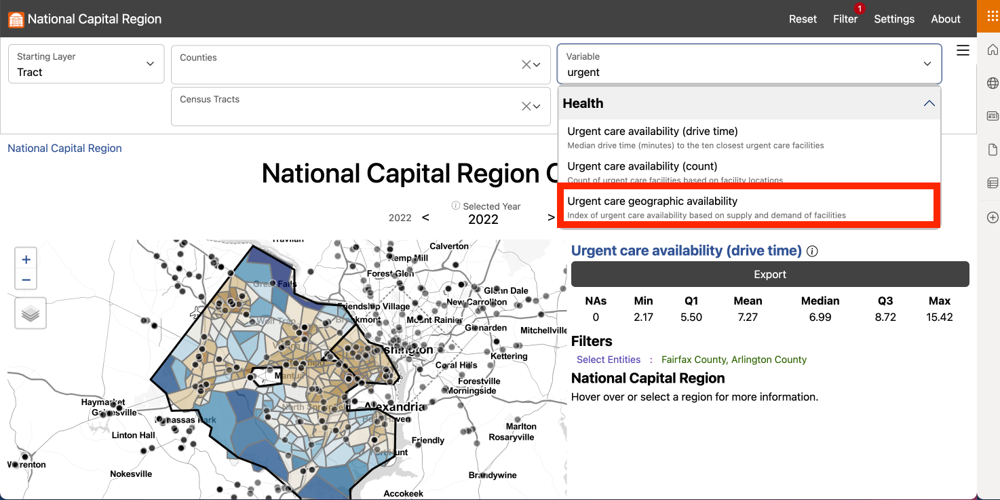
<li> In the Settings Menu, toggle Color by Rank on 
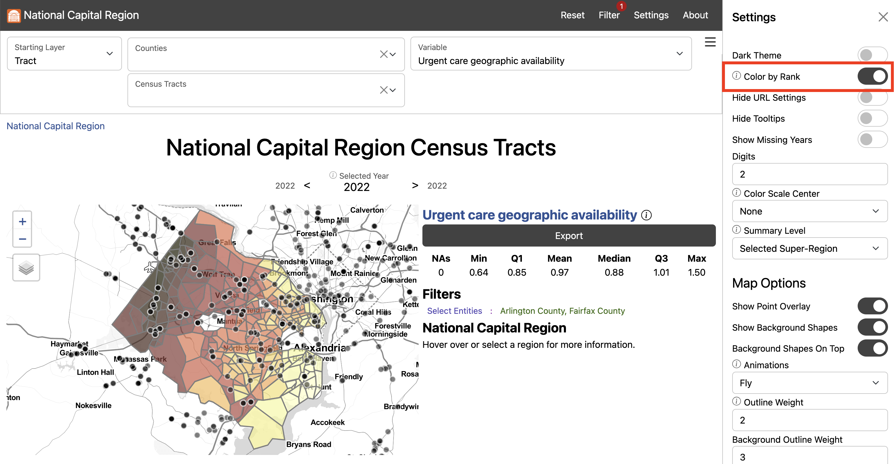
<li> Click Export to open the Export Window and select Download to download the data locally

</ol>
</span>
</figcaption>
</div>

Next, we analyzed access to urgent care health services by geographic availability using three-step floating catchment areas. Three-step floating catchment areas aggregates urgent care health services facilities per population ratio weighted by travel time. This provides a more complete picture of access to urgent care health services in these counties. <br /><br /><strong><blockquote> In Fairfax the areas with the lowest access to urgent care health services are northern McLean and the southwestern neighborhoods, including Fort Hunt and Huntington. </blockquote></strong> <strong><blockquote> In Arlington, neighborhoods near Marymount University and southern neighborhoods below Columbia Pike have the lowest access. </blockquote></strong> These areas have relatively high populations given the proximity of urgent care health services. The area with the greatest access is Centreville, Chantilly, and Herndon, which lie along a major roads in western Fairfax and have a relatively high number of urgent care health services for the population. Bailey's Crossroads and Annandale also have comparatively low access for the region.

<div style="float: left;">
<figcaption> Exhibit 4. Rank of 3-Step Floating Catchment Areas for Urgent Care Health Services Access Filtered by Lowest 25th Percentile Median Household Income in Arlington and Fairfax Counties by Census Tract, 2022 </figcaption>
{width="400px" class="story_image"}
<figcaption> Data source: Google Maps, accessed 2022. <br> 
Population data from the American Community Survey (ACS). <br>
Drive times calculated using Open Source Routing Machine. <a href = "https://uva-bi-sdad.github.io/capital_region/?plot_type=scatter&shape_type=tract&selected_variable=urgent_cnt&selected_year=2022&filter.time_min=2022&filter.time_max=2022&filter.county=51013,51059&median_household_income[last]%3C=101838"> <br> Explore this measure on our dashboard </a> <br>
<a onclick="reveal('Fig4');"> Steps to replicate this map <br> </a>  
<span class="hiddenText" id="Fig4">
<ol>
<li> Click "Filter" in the top left navigation bar to open the Filter Window
<li> In the Filter Window under "county" select "Arlington County" and "Fairfax County"
<li> Exit the Filter Window
<li> In the Starting Layer Menu, Select "Tract"

<li> In the Settings Menu under Summary Level select "Selected Super-Region"

<li> Scroll down to Map Options and input "2" for Outline Weight and "3" for Background Outline Weight

<li> Exit the Settings Menu
<li> In the Variable Menu, select urgent care health services geographic availability under Health

<li> In the Settings Menu, toggle Color by Rank on

<li> In the Filter Window, select Add Variable Condition
<li> Scroll down to select Median household income
<li> Input "Selected" for Component, "<=" for Operator, and Q1 for Value
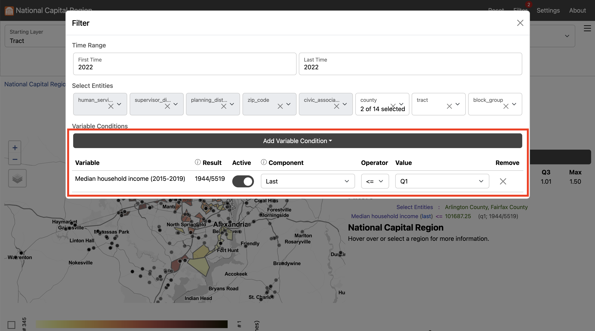
<li> Click Export to open the Export Window and select Download to download the data locally

</ol>
</span> 
</figcaption>
</div>

Applying filters to the dataset can help us zero in on populations and neighborhoods of interest. In this case, we filter for census tracts with a median household income in the lowest 25th percentile (below $101,838). This filter shows that some census tracts with low median household income are well served by urgent care health services, particularly in western Fairfax near Centreville, Chantilly, and Herndon. <strong><blockquote> Many census tracts, such as those in southern Arlington, Annandale, Bailey's Crossroads, and near Fort Hunt, have both a relatively low median household income and a relatively low access to urgent care health services. </blockquote></strong></div>

<div style="clear: both">


<div class="section_header">Is there inequity in access to urgent care health services by demographics?</div>

<div class="section_text">


<center>Demographics mapped in Fairfax and Arlington</center>

<div style = "text-align: center;">
<figcaption> Exhibit 5. Asian American/Pacific Islander Population in Arlington and Fairfax Counties by Census Tract, 2019 (Top Left), Black Population in Arlington and Fairfax Counties by Census Tract, 2019 (Top Right), Hispanic/Latino Population in Arlington and Fairfax Counties by Census Tract, 2019 (Bottom Left), White Population in Arlington and Fairfax Counties by Census Tract, 2019 (Bottom Right) </figcaption>

{width="700px" class="story_image"}
<figcaption>Data source: American Community Survey (ACS) Table B01001, accessed 2021.
    <a href = "https://uva-bi-sdad.github.io/capital_region/?plot_type=scatter&shape_type=county&selected_variable=demographics:race_hispanic_or_latino_percent_direct&selected_year=2019&filter.time_min=2009&filter.time_max=2019&filter.county=51013,51059"> <br> Explore these measures on our dashboard </a> <br>
<a onclick="reveal('Fig5');"> Steps to replicate this map <br> </a>  
<span class="hiddenText" id="Fig5">
<ol>
<li> Click "Filter" in the top left navigation bar to open the Filter Window
<li> In the Filter Window under "county" select "Arlington County" and "Fairfax County"
<li> Exit the Filter Window
<li> In the Starting Layer Menu, Select "Tract"

<li> In the Settings Menu under Summary Level select "Selected Super-Region"

<li> Scroll down to Map Options and input "2" for Outline Weight and "3" for Background Outline Weight

<li> Exit the Settings Menu
<li> In the Variable Menu, select Asian American/Pacific Islander population under Demographics
<li> In the Variable Menu, select Black population under Demographics
<li> In the Variable Menu, select Hispanic/Latino population under Demographics
<li> In the Variable Menu, select White population under Demographics
<li> Click Export to open the Export Window and select Download to download the data locally

</ol>
</span> 
</figcaption>
</div>

After developing a comprehensive measure of access, we began to dig into the question of equity of access to urgent care health services facilities by demographics. We observed that the neighborhoods affected by low access to urgent care health services have different demographic compositions.

Northern Arlington, where the population is largely white and high income on average, has some of the lowest access to urgent care health services in the region. 

The Southern Arlington and neighboring Bailey's Crossroads and Annandale in Fairfax have higher Hispanic/Latino populations and lower income on average. These areas also have relatively low access to urgent care health services. Bailey's Crossroads is also characterized by a high Latino population and lower average household income. 

Centreville, McLean, and Tyson's Corner have larger Asian American/Pacific Islander populations. Centreville has some of the highest access to urgent care health services in the region while McLean has some of the lowest access.

Some census tracts in Huntington and Fort Hunt have higher than average Black populations and lower than average household income. These areas are also the most underserved in access to urgent care health services.

In addition to income and demographic variables, we could explore access to urgent care health services by additional factors affecting health equity, including primary language spoken at home or access to health insurance. 

Having a comprehensive knowledge of the equity of access to urgent care health services within neighborhoods in Fairfax and Arlington counties empowers our local stakeholders to make more effective policy decisions to address and correct inequities.</div>

<div style="clear: both">

<div class="section_header">Exploring access to additional health services</div>

<div class="section_text">

Using the Social Impact Data Commons, we can explore access to additional health services using an equity lens. For example, we can explore differences in access to hospitals, primary care physicians, or substance use facilities. We find that access to these services across Fairfax and Arlington do not necessarily follow the same pattern. Using specific measures, policymakers can make informed decisions to address specific health equity gaps. 

</div>

<div style="clear: both">

## Performing statistical analyses {.tabset .tabset-fade .tabset-pills}

### R example {.active}

Using R statistical software, we can perform statistical analyses to analyze the relationships between variables.

```{r warning = FALSE, message = FALSE, fig.height = 10, fig.width = 14}
#
# retrieve
#

# define the set of variable we want to retrieve
variables <- c(
  "race_hispanic_or_latino_percent_direct", "race_afr_amer_alone_percent_direct",
  "race_AAPI_percent_direct", "race_wht_alone_percent_direct", "urgent_3sfca"
)
# use them to make an API URL
url <- paste0(
  "https://ncr-data-commons.netlify.app/api?", # base URL of the API
  "id=51013,51059&dataset=tract&time_range=2020,2022&include=", # query string defining a subset
  paste(variables, collapse = ",") # comma-separate version of the selected variables
)
# download and load the data directly
data <- read.csv(url)

#
# prepare
#

# since urgent care health services is only available in 2022, but demographics variables are only available
# up to 2020, we'll need to align time by moving urgent care health services to 2020

## first set urgent care health services in 2020 to that in 2022
data$urgent_3sfca[data$time == 2020] <- data$urgent_3sfca[data$time == 2022]
## then remove all but 2020 time points from the dataset
data <- data[data$time == 2020,]

# since we're interested in comparing counties, but looking at the tract level,
# we can add a variable for county, identified by the first 5 characters of the tract GEOID
data$county <- substring(data$ID, 1, 5)

# for plotting, we'll make a tall version of the dataset (to plot multiple variables at once),
# assign display-ready labels, and remove missing values (likely tracts with no people)
data_tall <- na.omit(data.frame(
  Value = unlist(data[, variables[1:4]]),
  variable = c(
    race_AAPI_percent_direct = "Asian American/ \n Pacific Islander \n Alone",
    race_hispanic_or_latino_percent_direct = "Hispanic or Latino",
    race_afr_amer_alone_percent_direct = "African American \n Alone",
    race_wht_alone_percent_direct = "White Alone"
  )[rep(variables[1:4], each = nrow(data))],
  urgent_3sfca = rep(data$urgent_3sfca, 4),
  County = c("51013" = "Arlington", "51059" = "Fairfax")[rep(data$county, 4)]
))

#
# analyze
#

# now we can look at the relationships between urgent care health services
# and each demographic variable within tracts, between counties
library(ggplot2)
ggplot(data_tall) +
  aes(x = Value, y = urgent_3sfca, color = County) +
  geom_point() +
  geom_smooth(method = lm, formula = y ~ x) +
  labs(
    y = "urgent care health services Providers per 10,000 People",
    x = "Percent of the Population",
    caption = ""
  ) +
  facet_grid(variable ~ .) +
  theme(text = element_text(size = 20))
```

### Python example

```{python}
#!/usr/bin/env python
# coding: utf-8

import requests
import pandas as pd
import io
import matplotlib.pyplot as plt
import seaborn as sns
import numpy as np
from plotnine import (ggplot,aes,geom_point,geom_smooth,labs,facet_grid)

variables = [
    "race_hispanic_or_latino_percent_direct", "race_afr_amer_alone_percent_direct",
    "race_AAPI_percent_direct", "race_wht_alone_percent_direct", "urgent_3sfca"
]

url = f"https://ncr-data-commons.netlify.app/api?id=51013,51059&dataset=tract&time_range=2020,2022&include={','.join(variables)}"

response = requests.get(url)
data = pd.read_csv(io.StringIO(response.text))

data

data['urgent_3sfca'].loc[data['time'] == 2020] = data['urgent_3sfca'].loc[data['time'] == 2022].values
data = data[data['time'] == 2020]
data['county'] = data['ID'].astype(str).str.slice(0, 5)

data
print(data.dtypes)

data.county.unique()

data1=data[data['county']=='51059']
data1.head()

data2=data[data['county']=='51013']
data2.head()

dt={}
dt_vars=vars_ = {"race_hispanic_or_latino_percent_direct":"Hispanic or Latino", "race_afr_amer_alone_percent_direct":"African American",
                 "race_AAPI_percent_direct":"Asian American", "race_wht_alone_percent_direct":"White Alone"}
vars_ = ["race_hispanic_or_latino_percent_direct", "race_afr_amer_alone_percent_direct","race_AAPI_percent_direct", "race_wht_alone_percent_direct"]
dt['variable']=[]
dt['value']=[]
dt['urgent_3sfca']=[]
for v_ in vars_:
    dt['value']+=list(data1[v_])
    dt['urgent_3sfca']+=list(data1['urgent_3sfca'])
    dt['variable']+=([dt_vars[v_]]*len(list(data1[v_])))
dt['County']=['51059']*len(dt['value'])
df1=pd.DataFrame(dt)
df1.head()

dt1={}
dt_vars=vars_ = {"race_hispanic_or_latino_percent_direct":"Hispanic or Latino", "race_afr_amer_alone_percent_direct":"African American",
                 "race_AAPI_percent_direct":"Asian American", "race_wht_alone_percent_direct":"White Alone"}
vars_ = ["race_hispanic_or_latino_percent_direct", "race_afr_amer_alone_percent_direct","race_AAPI_percent_direct", "race_wht_alone_percent_direct"]
dt1['variable']=[]
dt1['value']=[]
dt1['urgent_3sfca']=[]
for v_ in vars_:
    dt1['value']+=list(data2[v_])
    dt1['urgent_3sfca']+=list(data2['urgent_3sfca'])
    dt1['variable']+=([dt_vars[v_]]*len(list(data2[v_])))
dt1['County']=['51013']*len(dt1['value'])
df2=pd.DataFrame(dt1)
df2.head()

df=pd.concat([df1,df2])
df.head()

df.County.unique()

df = df.dropna()

# Rivanna is not letting us knit plots 

from plotnine import ggplot, aes, facet_grid, geom_point, geom_smooth, labs, scale_color_discrete

#(
#    ggplot(df, aes(x='value', y='urgent_3sfca', color='County')) +
#    facet_grid(facets="variable ~ .") +
#    geom_point() +
#    geom_smooth() +
#    labs(x='Percent of the Population', y='urgent care health services Providers per 10,000 People') +
#    scale_color_discrete(labels={'51013': 'Arlington', '51059': 'Fairfax'})
#)
```

## {-}

<br>

<div class="section_text">

We see that urgent care health services access is variable across census tracts in Arlington county, there does not appear to be a relationship between urgent care health services access demographics. In Fairfax County, census tracts with higher percentages of Asian American/Pacific Islander population appear to have higher access to urgent care health services, too. Additionally, census tracts with higher percentages of Black and White populations appear to have lower access to urgent care health services.

</div>

**Note:** If you find that the Social Impact Data Commons isn't displaying data properly, you may need to clear the dashboard settings (from the Settings Menu) or clear your browser cache. Please contact us if you have other issues.

`r htmltools::includeHTML("./footer.html")`

