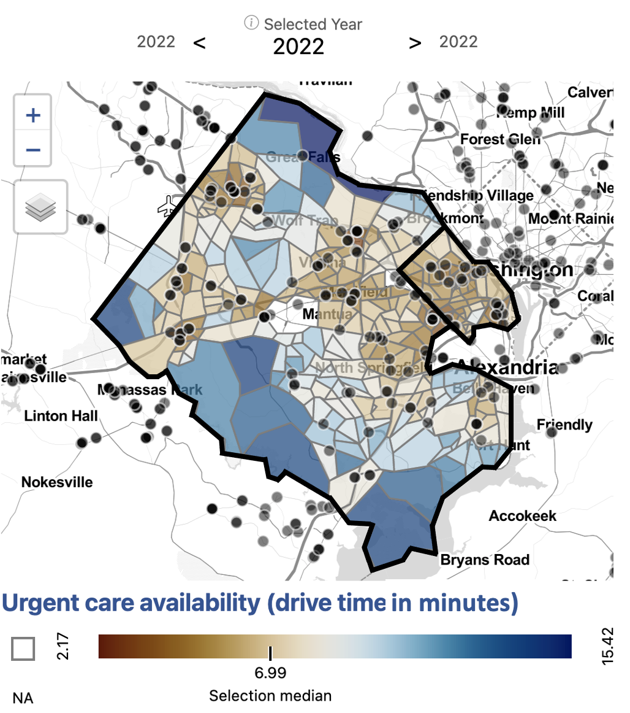

---
title: "Health Equity in the National Capital Region"
subtitle: "Is access to urgent care centers equitable in Arlington and Fairfax County?"
---

Issue overview

 Our partners in Arlington and Fairfax Counties were interested in understanding the equity of access to health services by neighborhood, by race, by household income, and by housing type. We began analyzing access to urgent care facilities. 

We inventoried a variety of urgent care location data sources for accuracy and quality. Given that urgent care is a rapidly growing health care service, we found that administrative datasets were incomplete by a wide margin. We found that [Google Maps](https://maps.google.com/) provided the most complete picture of urgent care facility locations in the Capital Region. To get a better understanding of the idea of access, we compared several measures.

Where are urgent cares in Arlington and Fairfax?

{width="400px" class="story_image"}
<figcaption style="width:400px;"> Data source: Google Maps, accessed 2022 <a href = "https://uva-bi-sdad.github.io/capital_region/?plot_type=scatter&shape_type=county&selected_variable=access_scores_urgent:urgent_cnt&selected_year=2021&filter.time_min=2021&filter.time_max=2021&filter.county=51013,51059">   Explore this measure on our dashboard </a>  
<a onclick="reveal('Fig1');"> Steps to replicate this map   </a>  

<ol>
<li> Clear browser cache and reset dashboard settings
<li> Click "Filter" in the top left navigation bar to open the Filter Window
<li> In the Filter Window under "county" select "Arlington County" and "Fairfax County"
<li> Exit the Filter Window
<li> In the Settings Menu, scroll down to Map Options
<li> Input "2" for Outline Weight and "3" for Background Outline Weight
<li> Exit the Settings Menu
<li> In the Variable Menu, select Urgent care geographic (count) under Health
</ol>

</figcaption>

First, we began by examining the locations of urgent care.   <blockquote> <strong>There are 113 urgent care facilities in Fairfax and 18 facilities in Arlington.</strong> </blockquote> By number of facilities, Fairfax has the greatest access to urgent care in the National Capital region. We calculated access to urgent care by count, or presence of an urgent care in a given geography. For most census tracts, there is no urgent care present. Fairfax and Arlington residents who live in a census tract without an urgent care may be able to easily drive to one nearby, though.

How long does it take to drive to urgent cares?

{width="400px" class="story_image"}
<figcaption style="width:400px;">Data source: Google Maps, accessed 2022.   
Drive times calculated using Open Source Routing Machine.
    <a href = "https://uva-bi-sdad.github.io/capital_region/?plot_type=scatter&shape_type=county&selected_variable=access_scores_urgent:urgent_near_10_median&selected_year=2021&filter.time_min=2021&filter.time_max=2021&filter.county=51013,51059">   Explore this measure on our dashboard </a>  
<a onclick="reveal('Fig2');"> Steps to replicate this map   </a>  

<ol>
<li> Clear browser cache and reset dashboard settings
<li> Click "Filter" in the top left navigation bar to open the Filter Window
<li> In the Filter Window under "county" select "Arlington County" and "Fairfax County"
<li> Exit the Filter Window
<li> In the Settings Menu under Summary Level select "Selected Super-Region"
<li> Scroll down to Map Options and input "2" for Outline Weight and "3" for Background Outline Weight
<li> Exit the Settings Menu
<li> In the Variable Menu, select Urgent care availability (drive time) under Health
</ol>

</figcaption>

    
  
The next measure of access we analyzed was drive time to the ten closest urgent care facilities. Here, we begin to see patterns of access emerge.   <strong><blockquote> Fairfax and Arlington residents who live in more urban areas, along major roads, or in Metro corridors, have greater access to urgent cares by drive time. </blockquote></strong> In Fairfax, the highest average drive time to the ten closest urgent cares is over 15 minutes, while the lowest is three minutes. Across Arlington, it can take as much as nine minutes to drive to the closest urgent care and and as little two minutes. In both these counties, geographic inequities exist in access to urgent care. Our measure of access, though, still does not take into account any population-level information.

How do we develop a comprehensive measure of access?

{width="700px" class="story_image"}
<figcaption style="width:700px;">Data source: Google Maps, accessed 2022.   
Population data from the American Community Survey (ACS).  
Drive times calculated using Open Source Routing Machine. 
    <a href = "https://uva-bi-sdad.github.io/capital_region/?plot_type=scatter&shape_type=county&selected_variable=access_scores_urgent:urgent_3sfca&selected_year=2021&filter.time_min=2021&filter.time_max=2021&filter.county=51013,51059">   Explore this measure on our dashboard </a>  
<a onclick="reveal('Fig3');"> Steps to replicate this map   </a>  

<ol>
<li> Clear browser cache and reset dashboard settings
<li> Click "Filter" in the top left navigation bar to open the Filter Window
<li> In the Filter Window under "county" select "Arlington County" and "Fairfax County"
<li> Exit the Filter Window
<li> In the Settings Menu under Summary Level select "Selected Super-Region"
<li> Scroll down to Map Options and input "2" for Outline Weight and "3" for Background Outline Weight
<li> Exit the Settings Menu
<li> In the Variable Menu, select Urgent care geographic availability under Health
<li> In the Settings Menu, toggle Color by Rank on 
</ol>

</figcaption>

Next, we analyzed access to urgent care by geographic availability using three-step floating catchment areas. Three-step floating catchment areas is an aggregation of facilities per population ratio weighted by travel time. Here, we see an even fuller picture access to urgent care in the region.   <strong><blockquote> In Fairfax the areas with the lowest access to urgent cares are the southwestern neighborhoods, including Fort Hunt and Huntington, and northern McLean. </blockquote></strong> <strong><blockquote> In Arlington, northern neighborhoods near Marymount University and southern neighbhorhoods below Columbia Pike have the lowest access. </blockquote></strong> These areas have relatively high populations given the proximity of urgent cares. The area with the greatest access is Centreville, Chantilly, and Herndon, which lie along a major roads in western Fairfax and have a relatively high number of urgent cares for the population. Bailey's Crossroads and Annandale also have comparatively low access for the region.

{width="400px" class="story_image"}
<figcaption style="width:400px;"> Data source: Google Maps, accessed 2022.   
Population data from the American Community Survey (ACS).  
Drive times calculated using Open Source Routing Machine. <a href = "https://uva-bi-sdad.github.io/capital_region/?plot_type=scatter&shape_type=tract&selected_variable=urgent_cnt&selected_year=2022&filter.time_min=2022&filter.time_max=2022&filter.county=51013,51059&median_household_income[last]%3C=101838">   Explore this measure on our dashboard </a>  
<a onclick="reveal('Fig4');"> Steps to replicate this map   </a>  

<ol>
<li> Clear browser cache and reset dashboard settings
<li> Click "Filter" in the top left navigation bar to open the Filter Window
<li> In the Filter Window under "county" select "Arlington County" and "Fairfax County"
<li> Exit the Filter Window
<li> In the Settings Menu under Summary Level select "Selected Super-Region"
<li> Scroll down to Map Options and input "2" for Outline Weight and "3" for Background Outline Weight
<li> Exit the Settings Menu
<li> In the Variable Menu, select Urgent care geographic availability under Health
<li> In the Settings Menu, toggle Color by Rank on
<li> In the Filter Window, select Add Variable Condition
<li> Scroll down to select Median household income
<li> Input "Selected" for Component, "<=" for Operator, and 101838 for Value
</ol>
 
</figcaption>

Applying filters to our dataset can help us zero in on populations and neighbhorhoods of interest. In this case, we filter for census tracts with a median household income in the lowest 25th percentile (below $101,838). We can see that some census tracts with low median household income are well served by urgent cares, particularly in western Fairfax near Centreville, Chanilly, and Herndon. <strong><blockquote> Many census tracts, such as those in southern Arlington, Annandale, Bailey's Crossroads, and near Fort Hunt, have both a relatively low median household income and a relatively low access to urgent care. </blockquote></strong>

Is there inequity in access to urgent cares by demographics?

Demographics mapped in Fairfax and Arlington

{width="700px" class="story_image"}
<figcaption style="width: 700px;">Data source: American Community Survey (ACS) Table B01001, accessed 2021.
    <a href = "https://uva-bi-sdad.github.io/capital_region/?plot_type=scatter&shape_type=county&selected_variable=demographics:perc_hispanic_or_latino&selected_year=2019&filter.time_min=2009&filter.time_max=2019&filter.county=51013,51059">   Explore these measures on our dashboard </a>  
<a onclick="reveal('Fig5');"> Steps to replicate this map   </a>  

<ol>
<li> Clear browser cache and reset dashboard settings
<li> Click "Filter" in the top left navigation bar to open the Filter Window
<li> In the Filter Window under "county" select "Arlington County" and "Fairfax County"
<li> Exit the Filter Window
<li> In the Settings Menu under Summary Level select "Selected Super-Region"
<li> Scroll down to Map Options and input "2" for Outline Weight and "3" for Background Outline Weight
<li> Exit the Settings Menu
<li> In the Variable Menu, select Asian American/Pacific Islander population under Demographics
<li> In the Variable Menu, select Black population under Demographics
<li> In the Variable Menu, select Hispanic/Latino population under Demographics
<li> In the Variable Menu, select White population under Demographics
</ol>
 
</figcaption>

</figcaption>

After developing a comprehensive measure of access, we began to dig into the question of equity of access to urgent care facilities by demographics. We observed that the neighborhoods affected by low access to urgent cares have different demographic compositions.

Northern Arlington, where the population is largely white and high income on average, has some of the lowest access to urgent cares in the region. 

The Southern Arlington and neighboring Bailey's Crossroads and Annandale in Fairfax have higher Hispanic/Latino populations and lower income on average. These areas also have relatively low access to urgent cares. Bailey's Crossroads is also characterized by a high Latino population and lower average household income. 

Centreville, McLean, and Tyson's Corner have larger Asian American/Pacific Islander populations. Centreville has some of the highest access to urgent care in the region while McLean has some of the lowest access.

Some census tracts in Huntington and Fort Hunt have higher than average Black populations and lower than average household income. These areas are also the most underserved in access to urgent care.

In addition to income and demographic variables, we could explore access to urgent care by additional factors affecting health equity, including primary language spoken at home or access to health insurance. 

Having a comprehensive knowledge of the equity of access to urgent care within neighborhoods in Fairfax and Arlington counties empowers our local stakeholders to make more effective policy decisions to address and correct inequities.

Exploring access to additional health services

Using the Social Impact Data Commons, we can explore access to additional health services using an equity lens. For example, we can explore differences in access to hospitals, primary care physicians, or substance use facilities. We find that access to these services across Fairfax and Arlington do not necessarily follow the same pattern. Using specific measures, policymakers can make informed decisions to address specific health equity gaps. 

`r htmltools::includeHTML("./footer.html")`

