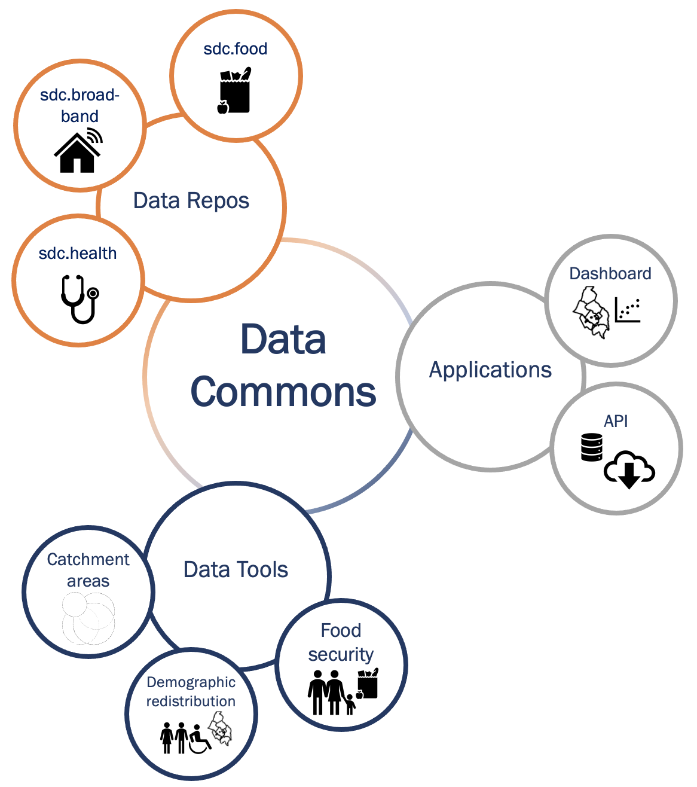

### A Data Commons is an open knowledge repository that **co-locates** data from a variety of sources, builds and **curates data insights**, and provides tools designed to track issues over time and geography allowing governments and key stakeholders to learn continuously from their own data. \n

 {width="600px"} 

For example, our data commons:

* Provides data, indicators, indices, case studies, and training
* Analyzes impact from social, economic, and health trends and major events 
* Enables ongoing learning from data
* Addresses issues of concern, for example, food insecurity, equity, lack of affordable housing

A Data Commons allows multiple audiences to explore issues relevant to their communities.

Below county level datasets measures derived from publicly collectable data sources -> actionable data for local government (in geographies they want, measuring what they want)

### Our motivation

To inform equitable and sustainable growth in Virginia and the National Capital Region

CLD3? Data Science framework?

### Key features

* Data sources, collected and created
* Maps reflecting multiple geographies
* Composite metrics
* Navigation and capability to statistically explore the data
* Data download via web or API 
* Metadata

