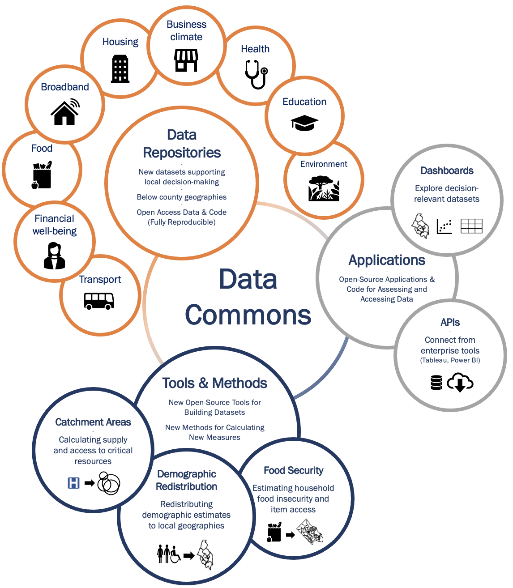

#### **DATA - APPLICATIONS - TOOLS - METHODS**

<table>
  <tr>
    <td>
    <h4>By creating new below county-level datasets and measures derived from publicly collectible data sources, we provide actionable data for local-level decision-making. We aim to inform equitable and sustainable growth in Virginia and the National Capital Region.</h4>
    </td>
  </tr>
  <tr>
    <td style="text-align: center;">
    {width="600px"}
    </td>
  </tr>
  <tr>
    <td>
    <h3>What is a Data Commons?</h3>
    <h4>A Data Commons is an open knowledge repository that **co-locates** data from a variety of sources, builds and **curates data insights**, and provides tools designed to track issues over time and geography. A Data Commons allows governments and key stakeholders to learn continuously from their own data.</h4>
    </td>
  </tr>
  <tr>
    <td>
    <h3>Our Social Impact Data Commons</h3>
<h4>
-   provides data, indicators, indices, case studies, and training
-   analyzes impact from social, economic, and health trends and major events
-   enables ongoing learning from data
-   addresses local issues of concern (food insecurity and equity, for example)
</h4>
    </td>
  </tr>
</table>

