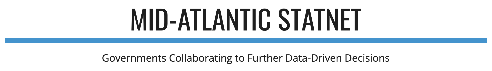
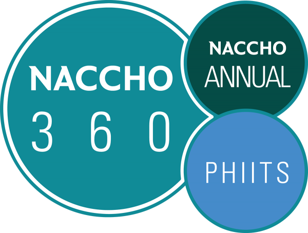
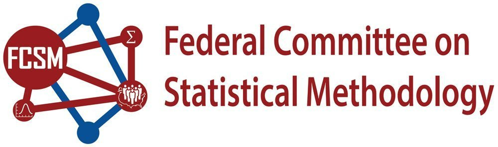
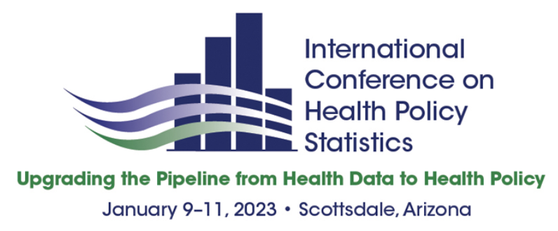

### Media coverage

 
 

The Social Impact Data Commons was featured in a presentation to the **Fairfax County Board of Supervisors Information Technology Committee** on 14 June 2022 in a Digital Equity/Broadband and Discussion. 

 
 

### Conference presentations

{width="300px" style="float: right;"}

**"The Social Impact Data Commons: A New Sustainable Architecture and Stakeholder Approach to Collect, Create, Validate and Distribute Sub-County-Level Datasets and Metrics to Support Regional Data-Driven Decision-Making"**, presented at the 2022 Association of Public Data Users (APDU) conference by Kathryn Linehan

 
 

{width="375px" style="float: left;"}

**“Data Re-Use in Action: Social Impact Data Commons”**, presented at the 2022 Mid-Atlantic Statistics Network (MASN) by Aaron Schroeder.

 
 

{width="200px" style="float: right;"}

**"Lessons Learned in Coordinating Large-Scale Data Science Initiatives"**, presented at the 2022 Joint Statistical Meetings by Joel Thurston

 
 
 
 

{width="250px" style="float: left;"}

**"The Virginia’s New Rural Health Data Commons, Featuring New Health-related Datasets and New Metrics for Visualizing Health Services Access"**, presented at the 2022 National Association of County and City Health Officials (NACCHO) annual conference by Aaron Schroeder and Cesar Montalvo

 
 

{width="300px" style="float: right;"}

**"Building the Social Impact Data Commons Data Discovery and Acquisition Lessons Learned"**, presented at the 2022 Federal Committee on Statistical Methodology (FCSM) Research and Policy Conference by Joanna Schroeder

 
 

{width="300px" style="float: left;"}

**"Virginia’s New Rural Health Data Commons: Informing Health Policy through Featuring Health Related Metrics for Visualizing Health Services Access"**, presented at the 2023 International Conference on Health Policy Statistics (ICHPS) by Cesar Montalvo and Joanna Schroeder

 
 
