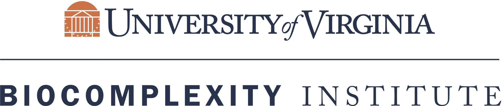

### Current partners

 {width="300px"} {width="300px"}

 {width="300px"} {width="300px"}

### About us

 [{width="300px"}](https://biocomplexity.virginia.edu/)

 The **Social and Decision Analytics Division** is a data science research group in the UVA Biocomplexity Institute. Our vision is to address social challenges requiring knowledge and perspectives from multiple disciplines. Our team includes statisticians, economists, public health experts, mathematicians, and social psychologists, all working together to understand how information about populations combines to reveal new truths. We are in Arlington, Virginia, a stone’s throw from Washington, D.C., and in close proximity to local, state, and federal policymakers. 

`r htmltools::includeHTML("./footer.html")`
