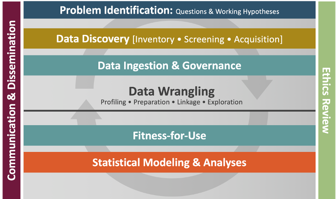
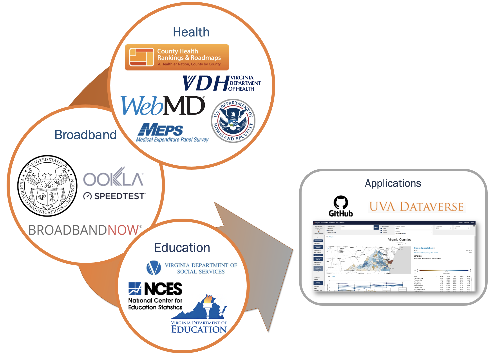

{width="600px"} 

#### We use our **Community Learning Through Data Driven Discovery (CLD3)** framework to drive the construction of the Social Impact Data Commons. Our initial grounding in **specific, local issues** is developed in partnership with community stakeholders in Arlington and Fairfax Counties in Virginia.

#### What is the CLD3 framework?

Our vision is to bring the data revolution to communities across our states through a process called Community Learning through Data Driven Discovery (CLD3). The key innovation in CLD3 is, as its name suggests, community-based research where the community participates in asking and answering the questions that drive information gathering and provide insights relevant to program or policy decisions. The CLD3 process liberates, integrates, and makes data available to local stakeholders including government, Cooperative Extension professionals, researchers, and citizens enabling them to bring local data insights to some of their most pressing challenges.

#### Unpacking the CLD3 process

The CLD3 process goes beyond the traditional organizing aspects of collective action programs and helps communities build capacity for data-informed decision making.
 

- Outer wheel: continuous interaction and communication across stakeholders
- Middle wheel: data-driven learning process
- Frontier between the outer and middle wheels: active collaboration between all partners
- Inner circle: rigorous research framework to guide the data science

#### Data Science Framework

{width="600px"} 

Our Data Science Framework provides a comprehensive, rigorous, and disciplined approach to problem solving that is at the heart of the Community Learning through Data Driven Discovery (CLD3) process. This includes identifying data sources, preparing them for use, and then assessing the value of these sources for the intended use(s).

Although the Data Science Framework is described in a linear fashion, it is far from a linear process as represented by the circular arrows underlying the diagram.

### Our initial local issues included

* equity of access to broadband communications
* equity and stability of access to staple foods
* transforming racial equity data into meaningful geographies

### Data collection

After grounding in local issues, we collected data from a variety of sources to create novel measures and datasets. These datasets feed into our applications, including our API and dashboard.

<!---
Local questions driving dataset creation
Arlington and Fairfax counties. 

Links to CLD3 article.

A Data Commons allows multiple audiences to explore issues relevant to their communities.

 (in geographies they want, measuring what they want).

CLD3? Data Science framework?

### Key features

* Data sources, collected and created
* Maps reflecting multiple geographies
* Composite metrics
* Navigation and capability to statistically explore the data
* Data download via web or API 
* Metadata

--->

#### References 

Doing Data Science: A Framework and Case Study [Article](https://hdsr.mitpress.mit.edu/pub/hnptx6lq/release/10) \n

Harvard Data Science Review, 2(1). (2020) S.A. Keller, S.S. Shipp, A. D., Schroeder, & G. Korkmaz
 

Helping Communities Use Data to Make Better Decisions [Article](https://issues.org/helping-communities-use-data-to-make-better-decisions/) \n

Issues in Science and Technology, Spring:83-89. (2018) S. Keller, S. Nusser, S. Shipp, C. Woteki
 

Harnessing the power of data to support community‐based research [ABS](https://onlinelibrary.wiley.com/doi/full/10.1002/wics.1426) \n

WIREs Comp Stat doi: 10.1002/wics.1426. (2018) S. Keller, S. Shipp, G. Korkmaz, E. Molfino, J. Goldstein, V. Lancaster, B. Pires, D. Higdon, D. Chen, A. Schroeder
 

Building Capacity for Data Driven Governance - Creating a New Foundation for Democracy
[Article](https://amstat.tandfonline.com/doi/abs/10.1080/2330443X.2017.1374897#.XIlm0xNKhR5) \n

Statistics and Public Policy, 4:1-11. (2017) S. A. Keller, V. Lancaster, S. Shipp

